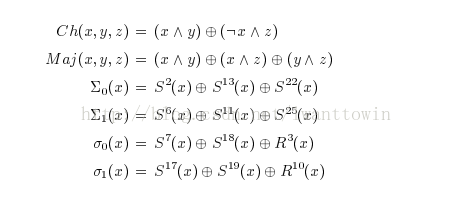
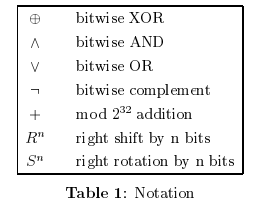
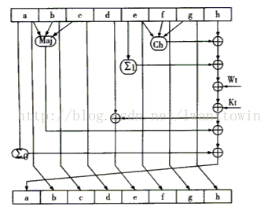

# 哈希

## 哈希函数

任意输入，固定输出，有效计算O(n)

SHA-0：

SHA-1：HASH160

SHA-2：HASH256、HASH512、HASH244、HASH384

SHA-3：Keccak

RIPEMD：RIPEMD-128、RIPEMD-160、RIPEMD-256、RIPEMD-320

### 加密安全的哈希函数：

- 碰撞阻力（collision-resistance）
-  隐秘性（hiding）
- 谜题友好（puzzle-friendliness）

#### 应用：

1. 信息摘要（message diget）

2. 承诺（commitment）

   com := commit(msg , nonce)

   verify(com , msg , nonce)

3. 搜索谜题

 

### 安全哈希算法（Secure Hash Algorithm 256，SHA-256）

**压缩函数（compression function）：**接受固定长度，具有碰撞阻力的哈希函数

**MD（Merkle-Damgard）变换：**将接受固定长度的哈希函数变换为可接受任意长度

 

**SHA256** 算法输入报文的最大长度不超过2^64 bit，输入按512-bit 分组进行处理，产生的输出是一个256-bit 的报文摘要

1. 将报文进行512位分组 + 488位补位 + 64位长度信息 = 512整数倍位数

2. 初始化8个共256位常量缓存

   A=0x6A09E667，B=0xBB67AE85，C=0x3C6EF372，D=0xA54FF53A，

   E=0x510E527F，F=0x9B05688C，G=0x1F83D9AB，H=0x5BE0CD19 

3. 处理512-bit（16 个字）报文分组序列。该算法使用了六种基本逻辑函数，由64步迭代运算组成。每步都以256-bit缓存值ABCDEFGH为输入，然后更新缓存内容，每步使用一个32-bit 常数值Kt和一个32-bit Wt

   

   

   	上图参与运算的都是32 bit的数，Wt是分组之后的报文，512 bit=32bit*16.

   	Wt t=1,2..16 由每一组512位报文再分16组产生

   	Wt t=17,18,..,64 由前面的Wt按递推公式计算出来。Wt递推公式为：

   	Kt t=1,2..64是已知的常数。

4. 所有512-bit分组处理完毕后，对于SHA-256算法最后一个分组产生的输出便是256-bit的报文摘要

 

**哈希指针（hash pointer）：**一个指向数据存储位置及其位置数据的哈希值的指针

可应用于任何基于指针且不包含闭环的数据结构

**区块链（block chain）：**通过哈希指针建立的链表

防篡改日志

 

**梅克尔树（Merkle trees）：**通过哈希指针建立的二叉树

隶属证明，验证时间与空间与log(n)同级

 

**排序梅克尔树**

非隶属证明
