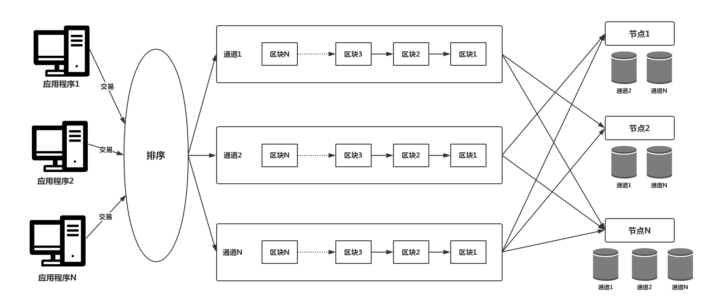
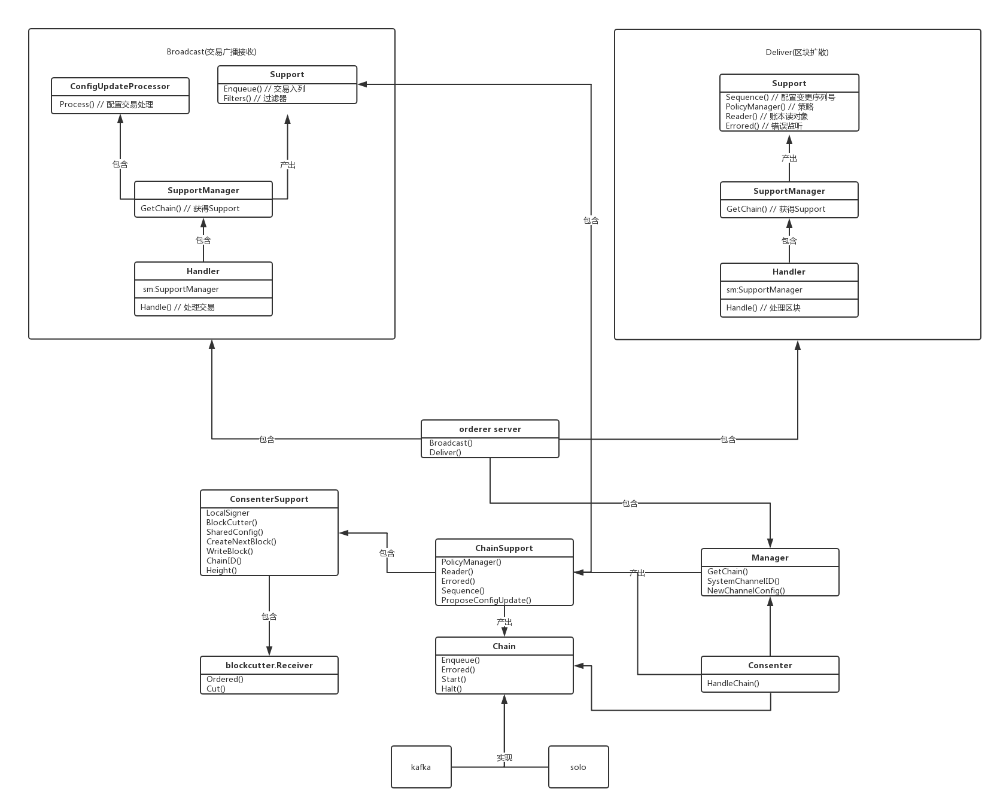
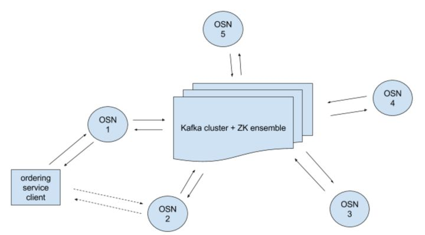
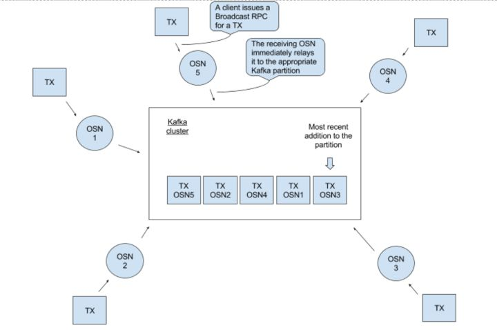
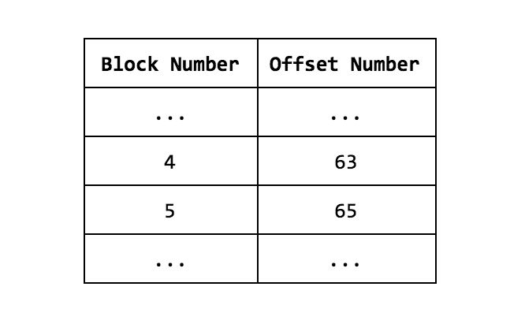
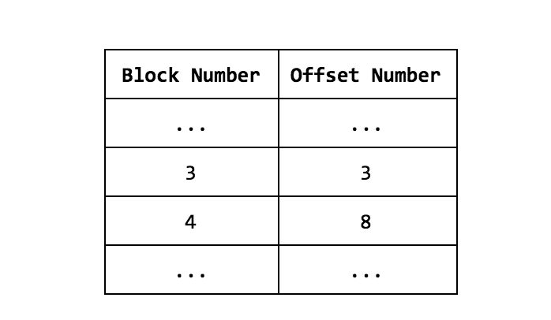
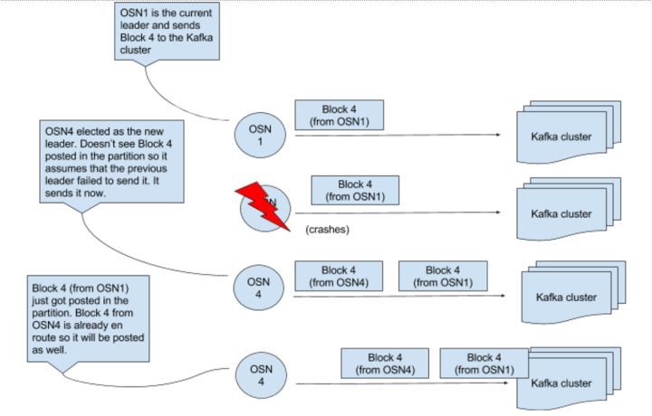
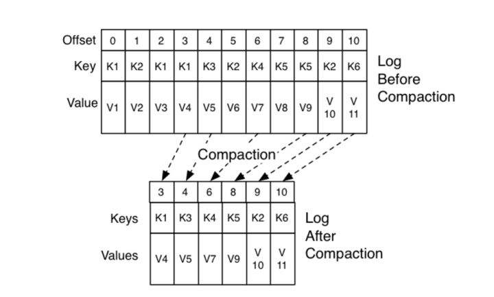
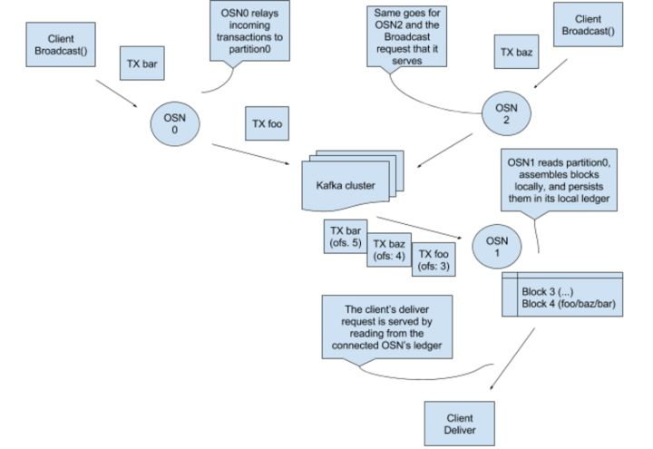

# 共识排序

**Orderer**节点从全网客户端接收交易，将交易进行排序，并将结果打包成区块，完成共识

- 交易排序

  目的：保证系统交易顺序的一致性（有限状态机）

  排序类型：solo、kafka

- 区块分发

  打包的区块是中间状态区块（非落盘区块/临时区块）

  包括有效交易&无效交易

- 多通道数据隔离

### Orderer节点排序代码解析（solo模式）

orderer接口图：

- **chainID**	链ID

- **block**        区块

  （cb.Block）

- **message**   交易信封

  （cb.Envelope）

- **configTx**       配置交易

​       （cb.Envelope）

- **cb.Envelope**           Payload + Signature

- **ledgerFactory**       账本读写集工厂，可GetOrCreate(chainID)一个ledger

  （ledger.Factory）

- **ledger**                      账本读写对象，可用来获取最新configTx，可append(block)

  （ledger.ReadWriter）

- **ledgerResource**    账本资源对象，包含一个ledger

  （api.Manager）

  （api.Resouce）

  （configupdate.Support）

- **multiLedger**

  （multichain.Manager）

  （multichain.chainCreator）

  - 多链manager实现类，包含一个ledgerFactory、一个chainSupport集、一个Consenter集、一个	systemChannel系统链
  - 可newLedgerResources(configTx)一个ledgerResouce
  - 可newChain(configTx)一个chainSupport 
  - 可GetChain(chainID)获取chainSupport

- **chainSupport**       链对象代理实现类，包含一个ledgerResouce、一个chain、一个cutter

  （multichain.ChainSupport），

  （multichain.ConsenterSupport）

  - 可CreateNextBlock(messages)将交易打包成一个区块

  - 可WriteBlock(block, committers, encodedMetadataValue)将区块写入账本
  - 可Enqueue(message) 将交易排入队列
  - 可start()启动chain的main函数

- **cutter**            区块切割对象

  （blockcutter.Receiver）

  - Ordered(message) 对message交易进行排序并返回要打包的交易数组

  - Cut() 直接返回所有待切割交易（意味着直接打包）

    切割规则依据：

    1. “配置交易”需要单独切割成区块（先打包之前未被切割打包的交易）
    2. 非单个交易的区块不能大于区块预设大小
    3. 单个区块的交易数量不能大于等于区块预设交易数量

- **solo.chain**    solo模式链对象实例

  （multichain.Chain）

  - main()：

    监听交易队列 -> 新交易排序 -> 排序时有切割则持久化区块

    有待切割交易且区块超时 -> 直接切割持久化区块

- **solo.consenter**	solo模式共识机制实例

  （multichain.Consenter）

  - 可HandleChain(cs, metadata)创建chain

- **broadcast.Handle**	实现orderer的broadcast服务，收到消息验证后调用Enqueue

- **deliver.Handle**		  实现orderer的deliver服务，收到消息验证后返回区块

### kafka模式的设计思路

在Hyperledger Fabric最新发布的1.0版本里，分拆出来Orderer组件用于交易的排序及共识。现阶段提供solo及kafka两种方式的实现。solo模式不用多讲，即整个集群就一个Orderer节点，区块链的交易顺序即为它收到交易的顺序。而kafka模式的Orderer相对较复杂，在实现之初都有多种备选方案，但最终选择了现在大家所看到的实现方式。那么其中的选型过程是怎么样的呢？我想将开发者Kostas Christidis的设计思路给大家解析一番，既是翻译也是我自身的理解。

Kafka模式的Orderer服务包含Kafka集群及相关联的Zookeeper集群，以及许多OSN（ordering service node）。

ordering service client可以与多个OSN连接，OSN之间并不直接通信，他们仅仅和Kafka集群通信。

OSN的主要作用：

- client认证
- 允许client使用SDK与Channel交互
- 过滤并验证configure transactions，比如重新配置channel或者创建新channel的transaction。

我们都知道，Messages(Records)是被写入到Kafka的某个Topic Partition。Kafka集群可以有多个Topic，每个Topic也可以有多个Partition。每个Partition是一个排序的、持久化的Record序列，并可以持续添加。

假设每个channel有不同的Partition。那么OSNs通过client认证及transaction过滤之后，可以将发过来的transaction放到特定channel的相关Partition中。之后，OSNs就可以消费这些Partition的数据，并得到经过排序后的Transaction列表。这对所有的OSN都是通用的。

在这种情况下，每一TX都是不同的Block。OSNs将每一个TX都打包成一个区块，区块的编号就是Kafka集群分配给TX的偏移编号，然后签名该区块。任意建立了Kafka消费者的Deliver RPCs都可以消费该区块。

这种解决方案是可以运行的，但是会有以下问题：

- 假设1秒有1000个Transactions，Ordering 现在就必须1秒生成1000个签名。并且接收端的clients必须能够在1秒里验证1000个签名。但通常签名和验证都是非常耗时的，这种情况下会非常棘手。所以为了避免一个区块只有一个交易的情况，引入batch机制。假设一个batch包含1000个交易，那么Ordering现在只需要生成1个签名，client也只需要验证1个签名。
- 如果发往Ordering的交易速度并不均匀，假设Ordering需要发出包含1000个交易的batch，现在已经有了999个交易存储在内存中，只需要等待1个交易就可以生成新的batch，但就是没有交易发往Ordering了。这时候前面的999个交易就被动延迟了，这当然是不可接受的。所以我们需要batch定时器，当有交易作为新batch的首个交易时启动定时器，只要batch达到最大交易数量或者定时器到点了，该batch都会形成新的区块。
- 但是呢，基于时间分割区块需要在Orderer之间协调时间。以交易数量分割区块是容易的，对任意的OSN来说，都会得到相同的区块。现在假设batch定时器设置为1秒，有两个OSN。刚刚生成了batch，这时候一笔新的交易通过OSN1进入到Kafka中。OSN2在时间t=5s的时候读取该交易，并设置了在t=6s的时候timeout。OSN1在时间t=5.6s的时候读取该交易，并设置了自己相应的timeout时间。下一笔交易被发送到Partition的末端，OSN2在t=6.2s的时候读取了该tx，而OSN1在t=6.5s的时候读取了该交易。这时候就会发现，OSN1的当前区块包含了2笔交易，而OSN2的区块只包含了前一笔交易。现在这两个OSN产生了不同的区块序列，这是不可接受的。因此，依照时间分割区块需要明确的协调信号。我们假设每个OSN在分割区块之前都向Partition发出消息“是时候分割区块X啦”（X是区块序列的下一个编号，TTC-X），并且不会真正的分割区块直到接收到任意TTC-X消息。接受到的这个消息不必一定是自己发出的，如果每个OSN都等待自己的消息，我们又得不到相同序列了。每个OSN分割区块，要么获取batchSize笔交易，或者接收到第一个TTC-X消息，无论哪种方式都会得到一致的区块，这也意味着所有的子序列TTC-X消息都会被忽略。
- 与例子中的每笔交易放在不同的区块不同，区块的编号现在没有被转换为Kafka的偏移量编号。所以如果Ordering服务接收到一个Deliver请求，让从区块5开始返回区块，这时候就根本不知道让消费者查找哪个偏移量。或许我们可以使用区块消息里的Metadata字段，让OSN标记该区块的偏移量区间（区块4的Metadata：offsets：63-64）。这样如果client想获取从区块5到区块9的数据，这样就可以从65开始读取，OSN重置Partition的日志到偏移量65，按照之前定义的batchsize和batchtimeout读取区块。但是有两个问题，1、我们违背了Deliver API协议，需要区块编号作为参数；2、如果client已经丢失了很多区块，并只想从区块 X开始同步区块，这时候就不知道正确的偏移量编号了，OSN也同样不能解决这个问题。所以每个OSN需要每个channel维护一张表，内容为区块编号到该区块的偏移量起始值的映射。这也就意味着一个OSN除非维护一张lookup表，否则不能应答Deliver请求。lookup表移除了区块metadata，也能快速定位区块偏移编号。OSN将请求的区块编号转换成正确的偏移编号，并启动Kafka消费者获取该区块。

- 无论何时OSN收到Deliver请求，都会从请求的区块编号开始查询所有的交易，并签名。打包操作和签名操作每次都被重复触发，代价很高。为解决这个问题，我们创建另一个Partition（Partition1），之前的Partition我们标记为Partition0。现在无论什么时候OSN分割区块的时候，都将分割后的结果放入Partition1，这样所有的Deliver请求都使用Partition1. 因为每个OSN都将其分割区块结果放入到Partition1中，因此Partition1中的区块序列并不是真正的channel的区块序列，且有重复。

这就意味着Kafka的偏移编号不能和OSN的区块编号对应起来，所以也需要建立区块编号到偏移量的lookup表。

- 现在在Partition1中现在有冗余的区块。Deliver请求不仅仅是建立Kafka消费者，从偏移量开始向后查找交易记录那么简单。lookup表需要随时被查询，deliver的逻辑变得更加复杂，查询lookup表增加了额外的延迟。是什么造成了Partition接受了冗余的数据呢？是Partition0的TTC-X消息么？还是被发往Partition1的消息和之前的消息一致或者相似？如何解决冗余的消息呢？我们先定义一条规则：如果Partition1已经接收到相同的消息（不算签名），那么就不再向Partition1添加该消息。在上面的例子中，如果OSN1已经知道Block3已经被OSN2放入到Partition1中了，OSN1将终止该操作。那么这样就可以降低冗余消息。当然不能完全消除他们，因为肯定有OSNs在相同时间插入相同的消息，这是无法避免的。

如果我们选举Leader OSN，它负责将区块写入到Partition1呢？有几种方法选举Leader：可以让所有的OSNs竞争ZooKeeper的znode，或者第一个发送TTC-X消息到Partition0的OSN。另外一个有趣的方法就是让所有的OSNs都属于相同的Kafka消费者组，意味着每笔交易只会被消费一次，那么无论哪个OSN消费了该交易，都会生成相同的区块序列。

如果Leader发送区块X消息，消息还未到达Partition1时Leader崩溃了，这时候会如何呢？其他OSNs意识到Leader崩溃了，因为Leader已经不再拥有znode，这时候会选举新的Leader。这时候新的Leader发现区块X还在他这里，还没有被发送到Partition1，所以他发送区块X到Partition1。同时，旧Leader的区块X消息也发送到了Partition1，消息又冗余了。

我们可以使用Kafka的日志压缩功能。

如果我们启用日志压缩，我们完全可以删除所有的冗余消息。当然我们假设所有的区块X消息拥有相同的key，X不同时，key也不同。但是因为日志压缩保存的是最新版本的key，所以OSNs可能会拥有陈旧的lookup表。假设上图的中key对应的是区块。OSN收到的前两个消息在本地的lookup表中有映射关系，同时，Partition被压缩成上图下方的部分，这时候查询偏移0/1会返回错误消息。另外一个问题就是Partition1中的区块不能逆向存储，所以Deliver逻辑同样复杂。事实上，仅仅考虑到lookup表的过期问题，日志压缩就不是一个好的方案。

所以没有一个很好的解决方案解决这个问题，我们回到问题5，创建另一个Partition1，解决重复分割、签名block的问题，我们可以摒弃这种方案，让每个OSN在本地保存每个channel的区块文件。

Delivery请求现在只需要顺序的读取本地ledger，没有冗余数据，没有lookup表。OSN只需要保存最后读取的偏移量，这样在重联之后就可以知道从哪里开始重新消费Kafka的消息。

一个缺点可能就是比直接通过Kafka提供服务慢，但是我们也从来不是直接从Kafka提供服务，本来就有一些操作需要OSNs本地进行，比如签名。

综上，ordering 服务使用一个单Partition（每channel）接收客户端的交易消息和TTC-X消息，在本地存储区块（每channel），这种解决方案能够在性能和复杂度之间取得较好的平衡。