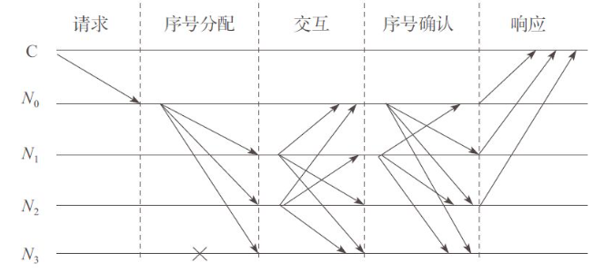
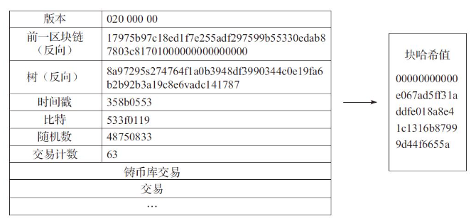
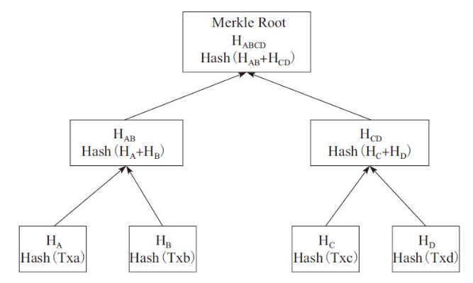
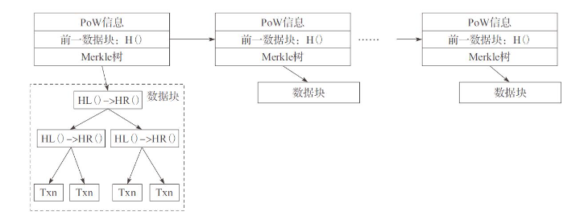
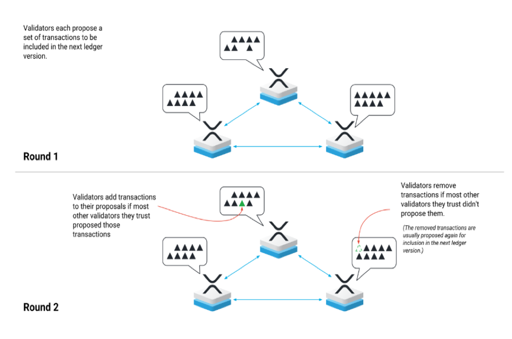
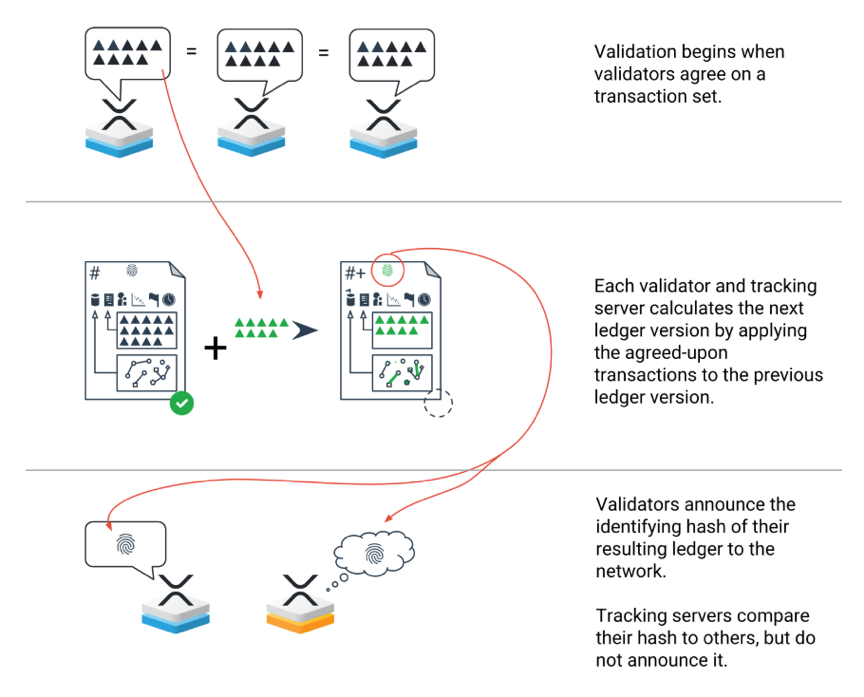
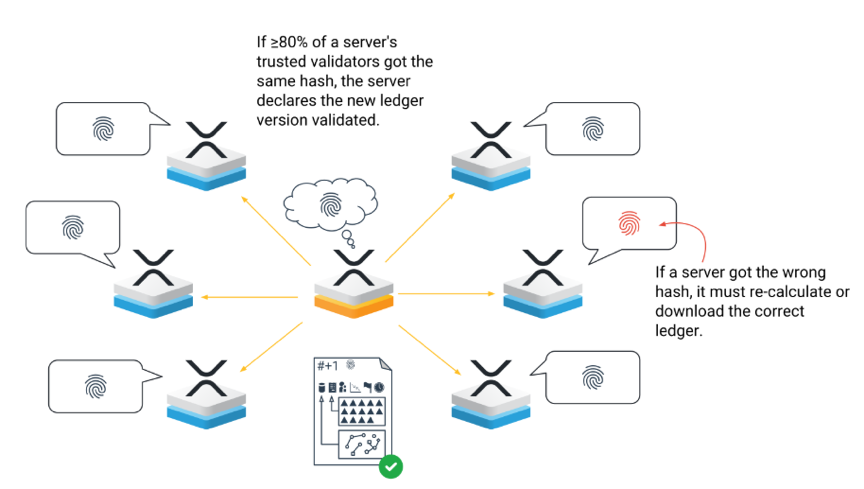
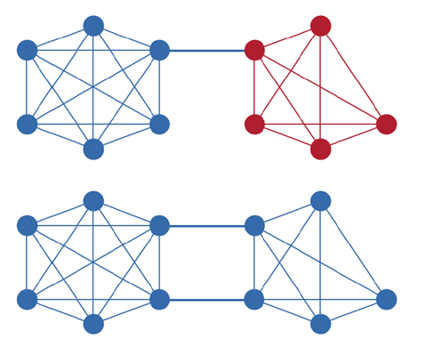
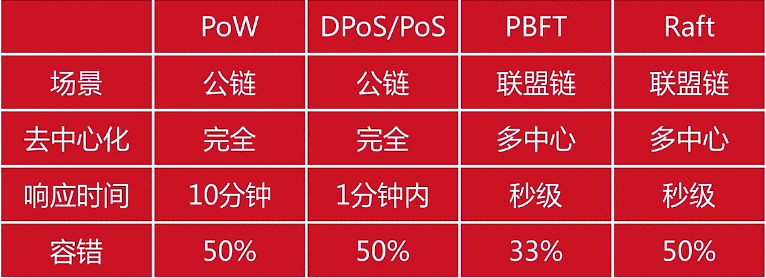

# 共识算法

## BFT：Byzantine Fault Tolerance，拜占庭容错技术

拜占庭容错技术（Byzantine Fault Tolerance，BFT）是一类分布式计算领域的容错技术。拜占庭假设是对现实世界的模型化，由于硬件错误、网络拥塞或中断以及遭到恶意攻击等原因，计算机和网络可能出现不可预料的行为。拜占庭容错技术被设计用来处理这些异常行为，并满足所要解决的问题的规范要求。

拜占庭容错技术来源于**拜占庭将军问题**。

在分布式系统中，特别是在区块链网络环境中，也和拜占庭将军的环境类似，有运行正常的服务器（类似忠诚的拜占庭将军），有故障的服务器，还有破坏者的服务器（类似叛变的拜占庭将军）。共识算法的核心是在正常的节点间形成对网络状态的共识。

通常，这些发生故障节点被称为**拜占庭节点**，而正常的节点即为**非拜占庭节点**。

拜占庭容错系统是一个拥有n台节点的系统，整个系统对于每一个请求，满足以下条件：

1. 所有非拜占庭节点使用相同的输入信息，产生同样的结果；
2. 如果输入的信息正确，那么所有非拜占庭节点必须接收这个信息，并计算相应的结果。

拜占庭系统普遍采用的假设条件包括：

1. 拜占庭节点的行为可以是任意的，拜占庭节点之间可以共谋；
2. 节点之间的错误是不相关的；
3. 节点之间通过异步网络连接，网络中的消息可能丢失、乱序并延时到达，但大部分协议假设消息在有限的时间里能传达到目的地；
4. 服务器之间传递的信息，第三方可以嗅探到，但是不能篡改、伪造信息的内容和验证信息的完整性。

原始的拜占庭容错系统由于需要展示其理论上的可行性而**缺乏实用性**。另外，还**需要额外的时钟同步机制支持**，**算法的复杂度也是随节点增加而指数级增加**。

## PBFT：Practical Byzantine Fault Tolerance，实用拜占庭容错算法

实用拜占庭容错系统（PBFT）降低了拜占庭协议的运行复杂度，从指数级别降低到多项式级别（Polynomial），使拜占庭协议在分布式系统中应用成为可能。

PBFT是一种状态机副本复制算法，即服务作为状态机进行建模，状态机在分布式系统的不同节点进行副本复制。每个状态机的副本都保存了服务的状态，同时也实现了服务的操作。将所有的副本组成的集合使用大写字母R表示，使用0到|R|-1的整数表示每一个副本。为了描述方便，通常假设故障节点数为m个，整个服务节点数为|R| = 3m+1个，这里m是有可能失效的副本的最大个数。尽管可以存在多于3m+1个副本，但是额外的副本除了降低性能之外不能提高可靠性。

PBFT要求共同维护一个状态，所有节点采取的行动一致。为此，需要运行三类基本协议，包括一致性协议、检查点协议和视图更换协议。我们主要关注支持系统日常运行的一致性协议。一致性协议至少包含若干个阶段：请求（request）、序号分配（pre-prepare）和响应（reply）。根据协议设计的不同，可能包含相互交互（prepare），序号确认（commit）等阶段。

**PBFT协议通信模式：**



上图为PBFT协议通信模式，每一个客户端的请求需要经过5个阶段，通过采用两次两两交互的方式在服务器达成一致之后再执行客户端的请求。由于客户端不能从服务器端获得任何服务器运行状态的信息，PBFT中主节点是否发生错误只能由服务器监测。如果服务器在一段时间内都不能完成客户端的请求，则会触发视图更换协议。其中C为客户端，N0~N3表示服务节点，特别的，N0为主节点，N3为故障节点。整个协议的基本过程如下：

1. 客户端发送请求，激活主节点的服务操作。

2. 当主节点接收请求后，启动三阶段的协议以向各从节点广播请求。

   1. 序号分配阶段，主节点给请求赋值一个序列号n，广播序号分配消息和客户端的请求消息m，并将构造PRE-PREPARE消息给各从节点；

   2. 交互阶段，从节点接收PRE-PREPARE消息，向其他服务节点广播PREPARE消息；

   3. 序号确认阶段，各节点对视图内的请求和次序进行验证后，广播COMMIT消息，执行收到的客户端的请求并给客户端以响应。

3. 客户端等待来自不同节点的响应，若有m+1个响应相同，则该响应即为运算的结果。

PBFT在很多场景都有应用，在区块链场景中，一般适合于对强一致性有要求的私有链和联盟链场景。例如，在IBM主导的区块链超级账本项目中，PBFT是一个可选的共识协议。在Hyperledger的Fabric项目中，共识模块被设计成可插拔的模块，支持像PBFT、Raft等共识算法。

## Raft协议

[**动画版Raft讲解**](http://thesecretlivesofdata.com/raft/	"动画版Raft讲解")

[**模拟器**](https://raft.github.io/  "模拟器")

Raft是Paxos的一种简化实现或变种，是由Stanford提出的一种更易理解的一致性算法，意在取代广为使用的Paxos算法。目前，在各种主流语言中都有了一些开源实现，比如本文中将使用的基于JGroups的Raft协议实现。

Raft最初是一个用于管理复制日志的共识算法，它是一个为真实世界应用建立的协议，主要注重协议的落地性和可理解性。Raft是在**非拜占庭故障**下达成共识的强一致协议。

在区块链系统中，使用Raft实现记账共识的过程可以描述如下：首先选举一个leader，接着赋予leader完全的权力管理记账。leader从客户端接收记账请求，完成记账操作，生成区块，并复制到其他记账节点。有了leader简化了记账操作的管理。例如，leader能够决定是否接受新的交易记录项而无需考虑其他的记账节点，leader可能失效或与其他节点失去联系，这时，系统就会选出新的leader。

在Raft中，每个节点会处于下面三种状态中的一种：

- **Follower：**所有结点都以follower的状态开始。如果没收到leader消息则会变成candidate状态
- **Candidate：**会向其他结点“拉选票”，如果得到大部分的票则成为leader。这个过程就叫做Leader选举(Leader Election)
- **Leader：**所有对系统的修改都会先经过leader。每个修改都会写一条日志(Log Entry)。leader收到修改请求后的过程如下，这个过程叫做日志复制(Log Replication)： 
  - 复制日志到所有follower结点(replicate entry)
  - 大部分结点响应时才提交日志
  - 通知所有follower结点日志已提交
  - 所有follower也提交日志
  - 现在整个系统处于一致的状态

**term逻辑时钟：**

- Term相当于paxos中的proposerID，相当于一个国家的朝代。term是一段任意的时间序号。每一任Leader都有一个与之前不同的term。
- 当Leader选举成功之后，一个节点成为了Leader，就会产生一个新的term，并且直到Leader故障，整个集群都会一直在这个term下执行操作。
- 如果leader选举失败了，则会再生成出一个term，再开启一轮leader选举。

**Quorum多数派：**

多数派，意思是超过一半的机器存活，则这个机器可用，这个Quorums指的就是集群可用的指标。例如：集群中的节点数为2N，如果有N+1的机器存活，则代表集群可用，可接受请求，写入log，应用到状态机中去，执行操作。如果少于N+1个机器存活，则代表集群可用，可接受请求，可写入log，但不应用到状态机中去，不执行操作。

**Raft阶段主要分为两个，首先是leader选举过程，然后在选举出来的leader基础上进行正常操作，比如日志复制、记账等。**

### 1. Leader Election

当follower在**随机选举超时时间（randomize election timeout）**内未收到leader的**心跳消息**，则转换为candidate状态。为了避免选举冲突，这个超时时间是一个150~300ms之间的随机数。

一般而言，在Raft系统中：

    1. 任何一个服务器都可以成为一个候选者candidate，它向其他服务器follower发出要求选举自己的请求。
    2. 投票要满足cadidate的term大于follower的term，或者两个term相等但cadidate的index大于follower的index。
    3. 投票请求若满足条件则先到先得，后到的请求予以否决。
    4. follower服务器同意了，发出OK。注意，如果在这个过程中，有一个follower宕机，没有收到请求选举的要求，此时候选者可以自己选自己，只要达到N/2+1的大多数票，候选人还是可以成为leader的。
    5. 这样这个候选者就成为了leader领导人，它可以向选民也就是follower发出指令，比如进行记账。
    6. 以后通过**心跳（heartbeat timeout）**进行记账的通知。
    7. 一旦这个leader崩溃了，那么follower中会出现新的候选者，并发出邀票选举。follower同意后，其成为leader，继续承担记账等指导工作。

### 2. Log Replication

Raft的记账过程按以下步骤完成：

    1. 假设leader领导人已经选出，这时客户端发出增加一个日志的要求。
    2. leader要求follower遵从他的**指令（Entry）**，都将这个新的日志内容追加到他们各自日志中。
    3. follower服务器将交易记录写入账本后，返回确认追加成功的消息
    4. leader接收到多数（**Quorums**）follower的回应后进行**提交（Commit）**处理，并向客户端发出确认成功信息。
    5. 在下一个心跳中，leader会通知所有follower更新确认的项目。

对于每个新的交易记录，重复上述过程。

在这一过程中，若发生网络通信故障，使得leader不能访问大多数follower了，那么leader只能正常更新它能访问的那些follower服务器。而大多数的服务器follower因为没有了leader，他们将重新选举一个候选者作为leader，然后这个leader作为代表与外界打交道，如果外界要求其添加新的交易记录，这个新的leader就按上述步骤通知大多数follower。当网络通信恢复，原先的leader就变成follower，在失联阶段，这个老leader的任何更新都不能算确认，必须全部回滚，接收新的leader的新的更新。

### 安全性

Raft的安全性，体现在如下几个方面：

- **Election safety：**在一个term下，最多只有一个Leader。

- **Leader Append-Only：**一个Leader只能追加新的entries，不能重写和删除entries。

- **Log Matching：**集群中各个节点的log都是相同一致的。

- **Leader Completeness：**如果一个log entry被committed了，则这个entry一定会出现在Leader的log里。

- **State Machine Safety：**如果一个节点服务器的state machine执行了一个某个log entry命令，则其他节点服务器，也会执行这个log entry命令，不会再执行其他命令。

## POW：Proof of Work，工作量证明

从去中心化账本系统的角度看，每个加入这个系统的节点都要保存一份完整的账本，但每个节点却不能同时记账，因为节点处于不同的环境，接收到不同的信息，如果同时记账的话，必然会导致账本的不一致，造成混乱。因此，需要有共识来达成哪个节点有权记账。比特币区块链通过竞争记账的方式解决去中心化的记账系统的一致性问题，即以每个节点的计算能力即“算力”来竞争记账权的机制。

在**比特币（Bitcoin）**系统中，大约每10分钟进行一轮算力竞赛，竞赛的胜利者，就获得一次记账的权力，并向其他节点同步新增账本信息。然而，在一个去中心化的系统中，谁有权判定竞争的结果呢？比特币系统是通过一个称为“工作量证明”（Proof of Work，PoW）的机制完成的。

简单地说，PoW就是一份确认工作端做过一定量工作的证明。PoW系统的主要特征是计算的不对称性。工作端需要做一定难度的工作得出一个结果，验证方却很容易通过结果来检查工作端是不是做了相应的工作。

举个例子，给定字符串“blockchain”，我们给出的工作量要求是，可以在这个字符串后面连接一个称为nonce的整数值串，对连接后的字符串进行SHA256哈希运算，如果得到的哈希结果（以**十六进制**的形式表示）是以若干个0开头的，则验证通过。为了达到这个工作量证明的目标，我们需要不停地递增nonce值，对得到的新字符串进行SHA256哈希运算。按照这个规则，需要经过2688次计算才能找到前3位均为0的哈希值，而要找到前6位均为0的哈希值，则需进行620969次计算。

```
1 blockchain1 → 4bfb943cba9fb9926df93f33c17d64b378d56714e8a29c6ba8bdc9690cea8e27  
2 blockchain2 → 01181212a283e760929f6b1628d903127c65e6fb5a9ad7fe94b790e699269221 ……
3 blockchain515 → 0074448bea8027bebd6333d3aa12fd11641e051911c5bab661a9b849b83958a7……
4 blockchain2688 → 0009b257eb8cf9eba179ab2be74d446fa1c59f0adfa8814260f52ae0016dd50f……
5 blockchain48851: 00000b3d96b4db1a976d3a69829aabef8bafa35ab5871e084211a16d3a4f385c……
6 blockchain6200969: 000000db7fa334aef754b51792cff6c880cd286c5f490d5cf73f658d9576d424
```

### **1. 工作量证明函数 及 区块数据计算过程**

比特币系统中使用的工作量证明函数是**SHA256**。

比特币区块结构如下图所示：



比特币的区块由区块头及该区块所包含的交易列表组成。区块头的大小为80字节，由4字节的版本号、32字节的上一个区块的哈希值、32字节的Merkle根哈希值、4字节的时间戳（当前时间）、4字节的当前难度值、4字节的随机数组成。区块包含的交易列表则附加在区块头后面，其中的第一笔交易是coinbase交易，这是一笔为了让矿工获得奖励及手续费的特殊交易。

拥有80字节固定长度的区块头，就是用于比特币工作量证明的输入字符串。因此，为了使区块头能体现区块所包含的所有交易，在区块的构造过程中，需要将该区块要包含的交易列表，通过**Merkle树算法**生成Merkle根哈希值，并以此作为交易列表的哈希值存到区块头中。其中Merkle树的算法图解如下图所示。

　　

　　

上图展示了一个具有4个交易记录的Merkle树的根哈希值的计算过程。首先以这4个交易作为叶子结点构造一棵完全二叉树，然后通过哈希值的计算，将这棵二叉树转化为Merkle树。

首先对4个交易记录：Txa~Txc，分别计算各自的哈希值HA~HC，然后计算两个中间节点的哈希值HAB = Hash(HA+HB) 和 HCD = Hash(HC+HD)，最后计算出根节点的哈希值HABCD = Hash(HAB+HCD)。

 

而构造出来的简化的区块链结构如上图所示。We find that: 所有在给定时间范围需要记录的交易信息被构造成一个Merkle树，区块中包含了指向这个Merkle树的哈希指针，关联了与该区块相关的交易数据，同时，区块中也包含了指向前一区块的哈希指针，使得记录了不同交易的单个区块被关联起来，形成区块链。

### **2. 挖矿难度**

挖矿难度值是比特币系统中的节点在生成区块时的重要参考指标，它决定了节点大约需要经过多少次哈希运算才能产生一个合法的区块。比特币的区块大约每10分钟生成一个，如果要在不同的全网算力条件下，新区块的产生都基本保持这个速率，难度值必须根据全网算力的变化进行调整。简单地说，难度值被设定在无论节点计算能力如何，新区块产生速率都保持在每10分钟一个。

难度的调整是在每个完整节点中独立自动发生的。每**2016个区块**，所有节点都会按统一的公式自动调整难度，这个公式是由最新2016个区块的花费时长与期望时长（期望时长为20160分钟，即两周，是按每10分钟一个区块的产生速率计算出的总时长）比较得出的，根据实际时长与期望时长的比值，进行相应调整（或变难或变易）。也就是说，如果区块产生的速率比10分钟快则增加难度，比10分钟慢则降低难度。　

这个公式可以总结为：
```
  新难度值 = 旧难度值 × ( 过去2016个区块花费时长 / 20160分钟 )
```
工作量证明需要有一个目标值。比特币工作量证明的目标值（Target）的计算公式：**目标值=最大目标值/难度值**

其中最大目标值为一个恒定值：0x00000000FFFFFFFFFFFFFFFFFFFFFFFFFFFFFFFFFFFFFFFFFFFFFFFFFFFFFFFF

目标值的大小与难度值成反比。比特币工作量证明的达成就是矿工计算出来的区块哈希值必须小于目标值。

### **3. PoW过程**　

比特币PoW的过程，可以简单理解成就是将不同的nonce值作为输入，尝试进行SHA256哈希运算，找出满足给定数量前导0的哈希值的过程。而要求的前导0的个数越多，代表难度越大。比特币节点求解工作量证明问题的步骤大致归纳如下：

1. 生成铸币交易，并与其他所有准备打包进区块的交易组成交易列表，通过Merkle树算法生成Merkle根哈希；
2. 把Merkle根哈希及其他相关字段组装成区块头，将区块头的80字节数据作为工作量证明的输入；
3. 不停地变更区块头中的随机数，即nonce的数值，并对每次变更后的区块头做双重SHA256运算（即SHA256（SHA256（Block_Header））），将结果值与当前网络的目标值做对比，如果小于目标值，则解题成功，工作量证明完成。

比特币的工作量证明，就是俗称“挖矿”所做的主要工作。

### **4. PoW能否解决拜占庭将军问题**　

关于比特币PoW共识机制能否解决拜占庭将军问题一直在业界有争议。2015年，Juan Garay对比特币的PoW共识算法进行了正式的分析，得出的结论是比特币的PoW共识算法是一种概率性的拜占庭协议（Probabilistic BA）。Garay对比特币共识协议的两个重要属性分析如下。

1. 一致性（Agreement）

   在不诚实节点总算力小于50%的情况下，同时每轮同步区块生成的几率很少的情况下，诚实的节点具有相同的区块的概率很高。用数学的严格语言说应该是：当任意两个诚实节点的本地链条截取K个节点，两条剩下的链条的头区块不相同的概率随着K的增加呈指数型递减。

2. 正确性（Validity）

   大多数的区块必须由诚实节点提供。严格来说，当不诚实算力非常小的时候，才能使大多数区块由诚实节点提供。

可以看到，当不诚实的算力小于网络总算力的50%时，同时挖矿难度比较高，在大约10分钟出一个区块情况下，比特币网络达到一致性的概念会随确认区块的数目增多而呈指数型增加。但当不诚实算力具一定规模，甚至不用接近50%的时候，比特币的共识算法并不能保证正确性，也就是，不能保证大多数的区块由诚实节点来提供。

因此，比特币的共识算法不适合于私有链和联盟链。其原因首先是它是一个最终一致性共识算法，不是一个强一致性共识算法。第二个原因是其共识效率低。提供共识效率又会牺牲共识协议的安全性。另外，比特币通过巧妙的矿工奖励机制来提升网络的安全性。矿工挖矿获得比特币奖励以及记账所得的交易费用使得矿工更希望维护网络的正常运行，而任何破坏网络的非诚信行为都会损害矿工自身的利益。因此，即使有些比特币矿池具备强大的算力，它们都没有作恶的动机，反而有动力维护比特币的正常运行，因为这和它们的切实利益相关。

PoW机制存在明显的弊端。一方面，PoW的前提是，节点和算力是均匀分布的，因为通过CPU的计算能力来进行投票，拥有钱包（节点）数和算力值应该是大致匹配的，然而随着人们将CPU挖矿逐渐升级到GPU、FPGA，直至ASIC矿机挖矿，节点数和算力值也渐渐失配。另一方面，PoW太浪费了。比特币网络每秒可完成数百万亿次SHA256计算，但这些计算除了使恶意攻击者不能轻易地伪装成几百万个节点和打垮比特币网络，并没有更多实际或科学价值。当然，相对于允许世界上任何一个人在瞬间就能通过去中心化和半匿名的全球货币网络，给其他人几乎没有手续费地转账所带来的巨大好处，它的浪费也许只算是很小的代价有鉴于此，人们提出了权益证明（Proof of Stake，PoS）。

## POS：Proof of Stake，股权证明

PoS类似于财产储存在银行，这种模式会根据你持有数字货币的量和时间，分配给你相应的利息。 

简单来说，就是一个根据你持有货币的量和时间，给你发利息的一个制度，在股权证明PoS模式下，有一个名词叫**币龄**，每个币每天产生1币龄，比如你持有100个币，总共持有了30天，那么，此时你的币龄就为3000，这个时候，如果你发现了一个PoS区块，你的币龄就会被清空为0。你每被清空365币龄，你将会从区块中获得0.05个币的利息(假定利息可理解为年利率5%)，那么在这个案例中，利息 = 3000 * 5% / 365 = 0.41个币，这下就很有意思了，持币有利息。

**点点币（Peercoin）**是首先采用权益证明的货币，点点币在SHA256的哈希运算的难度方面引入了币龄的概念，使得难度与交易输入的币龄成反比。在点点币中，币龄被定义为币的数量与币所拥有的天数的乘积，这使得币龄能够反映交易时刻用户所拥有的货币数量。实际上，点点币的权益证明机制结合了随机化与币龄的概念，未使用至少30天的币可以参与竞争下一区块，越久和越大的币集有更大的可能去签名下一区块。

然而，一旦币的权益被用于签名一个区块，则币龄将清为零，这样必须等待至少30日才能签署另一区块。同时，为防止非常老或非常大的权益控制区块链，寻找下一区块的最大概率在90天后达到最大值，这一过程保护了网络，并随着时间逐渐生成新的币而无需消耗大量的计算能力。点点币的开发者声称这将使得恶意攻击变得困难，因为没有中心化的挖矿池需求，而且购买半数以上的币的开销似乎超过获得51%的工作量证明的哈希计算能力。

权益证明必须采用某种方法定义任意区块链中的下一合法区块，依据账户结余来选择将导致中心化，例如单个首富成员可能会拥有长久的优势。为此，人们还设计了其他不同的方法来选择下一合法区块。

PoS机制虽然考虑到了PoW的不足，但依据权益结余来选择，会导致首富账户的权力更大，有可能支配记账权。股份授权证明机制（Delegated Proof of Stake，DPoS）的出现正是基于解决PoW机制和PoS机制的这类不足。

## DPOS：Delegated Proof of Stake，委任权益证明

**比特股（Bitshare）**是一类采用DPoS机制的密码货币，它期望通过引入一个技术民主层来减少中心化的负面影响。

比特股的DPoS机制，中文名叫做**股份授权证明机制（又称受托人机制）**，它的原理是让每一个持有比特股的人进行投票，由此产生101位代表 , 我们可以将其理解为101个超级节点或者矿池，而这101个超级节点彼此的权利是完全相等的。从某种角度来看，DPOS有点像是议会制度或人民代表大会制度。如果代表不能履行他们的职责（当轮到他们时，没能生成区块），他们会被除名，网络会选出新的超级节点来取代他们。DPOS的出现最主要还是因为矿机的产生，大量的算力在不了解也不关心比特币的人身上，类似演唱会的黄牛，大量囤票而丝毫不关心演唱会的内容。

比特股引入了见证人这个概念，见证人可以生成区块，每一个持有比特股的人都可以投票选举见证人。得到总同意票数中的前N个（N通常定义为101）候选者可以当选为见证人，当选见证人的个数（N）需满足：至少一半的参与投票者相信N已经充分地去中心化。

见证人的候选名单每个维护周期（1天）更新一次。见证人然后随机排列，每个见证人按序有2秒的权限时间生成区块，若见证人在给定的时间片不能生成区块，区块生成权限交给下一个时间片对应的见证人。DPoS的这种设计使得区块的生成更为快速，也更加节能。

DPoS充分利用了持股人的投票，以公平民主的方式达成共识，他们投票选出的N个见证人，可以视为N个矿池，而这N个矿池彼此的权利是完全相等的。持股人可以随时通过投票更换这些见证人（矿池），只要他们提供的算力不稳定，计算机宕机，或者试图利用手中的权力作恶。

比特股还设计了另外一类竞选，**代表竞选**。选出的代表拥有提出改变网络参数的特权，包括交易费用、区块大小、见证人费用和区块区间。若大多数代表同意所提出的改变，持股人有两周的审查期，这期间可以罢免代表并废止所提出的改变。这一设计确保代表技术上没有直接修改参数的权利以及所有的网络参数的改变最终需得到持股人的同意。

## POA：Proof of Authority，权威证明

权威证明（Proof-of-Authority）或者PoA是一种算法。通过基于**身份权益（identity as a stake）**的共识机制，它可以提供更快的交易速率（与PoW相比）。这个术语是由以太坊（Ethereum）和Parity Technologies公司的联合创始人Gavin Wood创建的，并且目前用于Kovan——以太坊的测试网络（testnet networks）之一。

交易和块通过被批准的帐户（称为验证器）来验证。该过程是自动化的，并且激励被批准和被信任的验证者保持网络的安全性和一致性。

建立权威，必须满足三个主要条件：

1. 必须在链上验证身份。
2. 为了使验证过程有价值并提供足够的激励，应使资格很难获得。
3. 建立权威时，在其检查和程序上必须具有完全的一致性。

**使用案例**

一个流行的利用PoA机制的区块链项目是 Oracle Network。作为一个基于以太坊的公共网络，它允许更快地执行智能合同（Smart Contract），并使用受尊敬的个人共识，使区块链对于从小商家到大企业的每个人来说,都是负担得起的而且是可访问的。

此外，还有一个正在使用PoA机制进行新代币开发和交易速度提升的新项目。Lindax是一个去中心化平台，用于交易与创造定制化的数字资产，是Go & CPP 以太坊的一个分支。当公司在LindaX网络上创建代币时，它们还将帮助确认交易的有效性，从而减少在区块链上的不当行为，同时消除消耗性成本。

## RPCA：Ripple Protocol consensus algorithm，瑞波协议共识算法

Ripple（瑞波）是一种基于互联网的开源支付协议，可以实现去中心化的货币兑换、支付与清算功能。

### 基本概念

**服务节点（Rippled）：**可以接收交易的区块链节点，包括**追踪节点**和**验证节点**。客户端应用提交交易请求给服务节点（Rippled），服务节点以最近验证过的帐本为依据进行交易检查，检查通过的交易进入候选交易集合。

- **追踪节点（tracking node）：**主要功能是分发交易信息以及响应客户端的账本请求。

- **验证节点（validating node）：**被其它节点接入到信任列表中的节点，除包含追踪节点的所有功能外，还参与共识过程。

区块用于记录交易，在RPCA中有两种区块比较关键：

- **最新关闭区块（Last Closed Ledger）：**也就是最新被共识过的区块
- **开放区块：**也就是当前正在被共识的区块，当开放区块被共识过，也就成了最新关闭区块

**信任节点列表UNL（unique node list）：**每个服务节点都会维护一个信任节点列表，这里信任并不是指信任每一个节点， 而是指信任这个列表中的节点不会联合起来作弊。在共识过程中，我们只接受来自信任节点列表中的节点投票。在Ripple中，使用配置文件中加入其它验证节点的公钥的方式来制定UNL。

### RPCA共识过程

Ripple网络每隔几秒就会产生一个新的区块，这个区块的产生过程就是所有网络节点RPCA共识的过程。假设共识过程是成功的，并且网络中没有分叉产生，那么新生成的区块就是全网唯一的

整个RPCA共识过程分为如下两个阶段：

- 交易共识，形成交易集
- 区块打包，再共识

#### 1. 交易共识，形成交易集

1. 每个验证节点会不断收到从网络发送过来的交易，通过与本地账本数据验证后，不合法的交易直接丢弃，合法的交易将汇总成**交易候选集（candidate set）**。交易候选集里面还包括之前共识过程无法确认而遗留下来的交易。
2. 每个验证节点把自己的交易候选集作为提案发送给其他验证节点。
3. 验证节点在收到其他节点发来的提案后，如果不是来自UNL上的节点，则忽略该提案；如果是来自UNL上的节点，就会对比提案中的交易和本地的交易候选集，如果有相同的交易，该交易就获得一票。在一定时间内，当交易获得超过50%的票数时，则该交易进入下一轮。没有超过50%的交易，将留待下一次共识过程去确认。
4. 验证节点把超过50%票数的交易作为提案发给其他节点，同时提高所需票数的阈值到60%，重复步骤3、步骤4，直到阈值达到80%。
5. 验证节点把经过80%UNL节点确认的交易正式写入本地的账本数据中，称为最后关闭账本。



#### 2. 区块打包，再共识

形成交易集后，每个节点开始打包新的区块，打包区块的过程如下：





1. 把当前区块号、共识交易集的Merkle树根Hash、父区块Hash、当前时间戳等内容放到一起，计算一个区块哈希。
2. 每个节点广播自己得出的区块哈希到它可见的节点，这里的可见节点不仅仅指可信列表中的节点，而是通过节点发现过程能发现的节点。
3. 节点收集到它所有可信列表中节点广播过来的区块哈希后，结合自己生成的区块哈希，对每个区块哈希计算一个比例，如果某一哈希的比例超过一个阈值（一般是80%），则认为这个哈希是共识通过的区块哈希。如果自己的哈希与之相同，则说明自己打包的区块得到了确认，是新的被共识过的区块，直接存到本地，并且更新状态。如果自己的哈希与共识通过的哈希不同，那就需要去某个区块哈希正确的节点索要新的区块信息，要到之后存储到本地并且更新当前状态。
4. 如果上面没有对某一区块哈希超过设定的阈值，那么重新开始共识过程，直到满足条件。

### 验证

- 正确性

RPCA中正确性的验证方式很简单，因为共识需要80%的阈值，那么只要UNL中有80%的诚实节点，就能达成共识，另外即使有超过20%的欺诈节点，也不能破坏正确性，因为欺诈节点也必须达到80%以上才能达成共识。无论欺诈节点还是诚实节点，达不到80%，都无法通过共识。

- 一致性

RPCA中一致性是通过子网络与其它子网络的连通性来保证的，要保证区块链不分叉，必须确保每个子网络必须至少与整个网络节点中的20%保持连通性。达到20%连通性的前提下，如果一个子网络中得出的共识区块哈希与整个网络得出的不一致，也就无法达成80%的共识要求，也就无法产生分叉。



- 可用性

在每一轮投票过程中，节点会搜集它UNL中每个节点的响应时间，一直响应时间慢的节点将会被剔除出去，这样UNL就能保持一个较高的沟通效率。在高效沟通的前提下，RPCA算法能保证每3秒左右就能产生一个区块，Ripple官方给出的tps数据是1500。这样的性能基本能满足一般的生产需求。

在Ripple的共识算法中，参与投票节点的身份是事先知道的，因此，算法的效率比PoW等匿名共识算法要高效，交易的确认时间只需几秒钟。当然，这点也决定了该共识算法只适合于**权限链（Permissioned chain）**的场景。Ripple共识算法的拜占庭容错（BFT）能力为( n-1 ) / 5，即可以容忍整个网络中20%的节点出现拜占庭错误而不影响正确的共识。

## 总结

> **“** 在区块链网络中，由于应用场景的不同，所设计的目标各异，不同的区块链系统采用了不同的共识算法。一般来说，在私有链和联盟链情况下，对一致性、正确性有很强的要求。一般来说要采用强一致性的共识算法。而在公有链情况下，对一致性和正确性通常没法做到百分之百，通常采用最终一致性（Eventual Consistency）的共识算法。**”**

通俗点就是：共识算法的选择与应用场景高度相关，可信环境使用paxos或者raft，带许可的联盟可使用pbft ，非许可链可以是pow，pos，ripple共识等，根据对手方信任度分级，自由选择共识机制。

