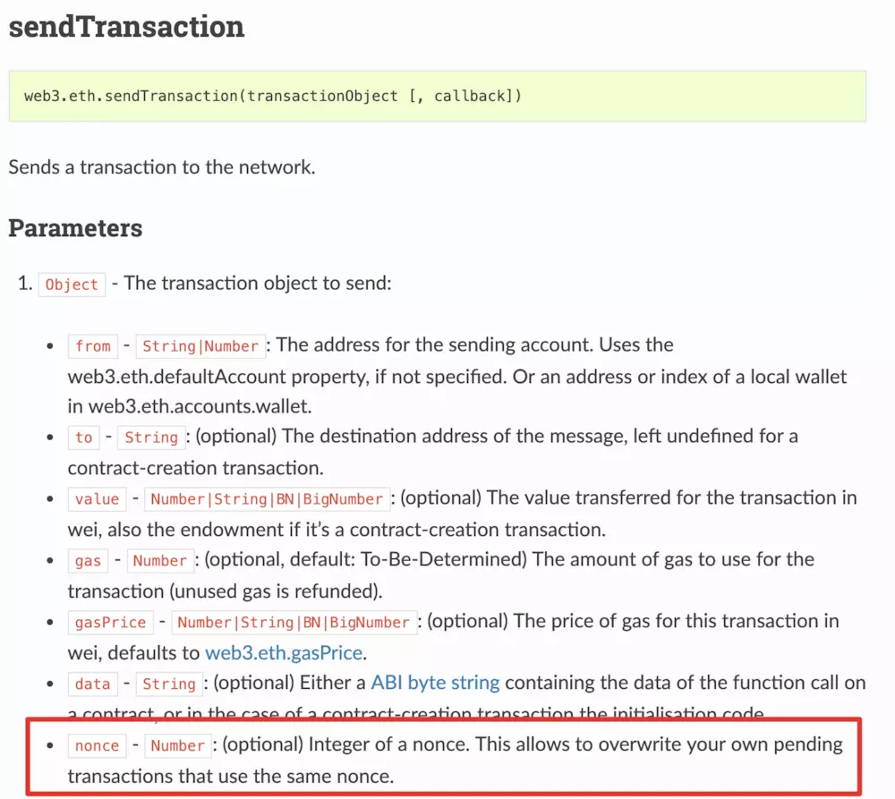

# 开发

### Geth

Geth是Go Ethereum开源项目的简称，它是使用Go语言编写且实现了Ethereum协议的客户端软件

**创建账号：**

- 使用geth account new
- 使用geth控制台 > personal.newAccount()
- 使用Mist以太坊钱包

**更新账号：**

```bash
geth account update xxxxxxxxxxxxxxxxxxxxxxxxxxxxxxxxxxxxxxxx
```

**备份/恢复账号：**直接复制/覆盖keystore中的账号钥匙文件

**导入未加密私钥：**

```bash
geth account import <keyfilepath>/<keyfile>
```

**查看以太坊数据：**

https://EthStats.net

https://www.EtherNodes.org

**检查连接和ENODE身份**

```bash
 > admin.peers

 > admin.nodeInfo
```

**更快下载区块链**

```bash
geth –fast –cache=1024 –jitvm console
```

**导出/导入区块链**

```bash
geth export filename

geth import filename
```


**Whisper** 以太坊开发人员开发的去中心化的通讯协议

**Swarm**    以太坊开发人员开发的去中心化的文件系统

 

**Truffle**：以太坊智能合约开发环境，测试框架，以太坊的资源管理通道

**Ganache**：以太坊节点仿真器软件

 

### **Truffle**

1. 安装Truffle

   ```bash
   npm install --global --production windows-build-tools  //Windows环境需要先安装依赖
   npm install -g truffle
   ```

2. 创建Truffle项目

   ```bash
   truffle unbox xxxxx
   //or
   truffle init
   ```

3. Truflle项目目录结构

   contracts/:智能合约目录，sol文件

   migrations/:用作移植的脚本文件，js文件

   test/: 测试文件目录，sol或js文件

   truffle-config.js: Truffle 配置文件

4. 编译

   ```bash
   truffle compile
   ```

5. 部署

   migrations/中编写移植脚本，然后：

   ```bash
   truffle migrate
   ```

6. 测试

   test/中编写测试代码

7. JS中Web3初始化

   设置provider，创建一个web3实例

   ```js
   	if (typeof web3 !== 'undefined') {
   		App.web3Provider = web3.currentProvider;
   	} else {
   		// set the provider you want from Web3.providers
   		App.web3Provider =
   		new Web3.providers.HttpProvider("http://localhost:8545");
   		web = new Web3(App.web3Provider);
   	}
   ```

8. JS中初始化合约

   获取build/contracts/中的合约json（data）

   ```js
   App.contracts.conxxxx = TruffleContract(data);
   App.contracts.conxxxx.setProvider(App.web3Provider);
   ```

9. 合约交互

   ```js
   	//获取当前以太坊账户
   	web3.eth.getAccounts(function(error, accounts){
   		var account = accounts[0];
   		//获取合约实例：
   		App.contracts.conxxxx.deployed().then(function(conxxxxInstance){
   			//调用合约方法：
   			return conxxxxInstance.funname.call();
   			//or return conxxxxInstance.funname(arg... , {from: account});
   		}).then(function(resulet){
           	//TODO
   		}).catch(function(err){
   			//console.log(err.message);
   		})
   	})
   ```


### 交易中的Nonce详解

在比特币中，nonce主要用于调整pow挖矿的难度，而在以太坊中，除了调整挖矿难度外，在外部账户的每笔交易中也都存在一个nonce。这个nonce是一个连续的整数，在每个账户发送交易时所产生，其主要设计目的是为防止双花。



1. 以太坊中有两种nonce，一种是在区块中的nonce，主要是调整挖矿难度；一种是每笔交易中nonce。
2. 每个外部账户（私钥控制的账户）都有一个nonce值，从0开始连续累加，每累加一次，代表一笔交易。
3. 某一地址的某一交易的nonce值如果大于当前的nonce，该交易会被放到交易池的queued列表中，直到缺失的nonce被提交到交易池中。
4. 地址的nonce值是一个连续的整数，起设计的主要目的是防止双花。
5. 在发生一笔交易时，如果不指定nonce值时，节点会根据当前交易池的交易自动计算该笔交易的nonce。有可能会出现节点A和节点B计算的nonce值不一样的情况。


