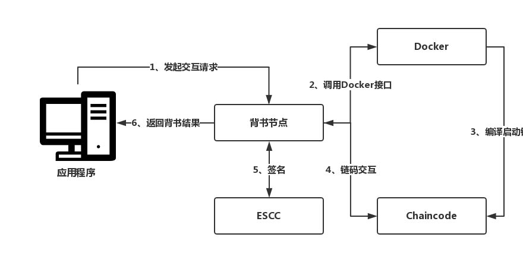
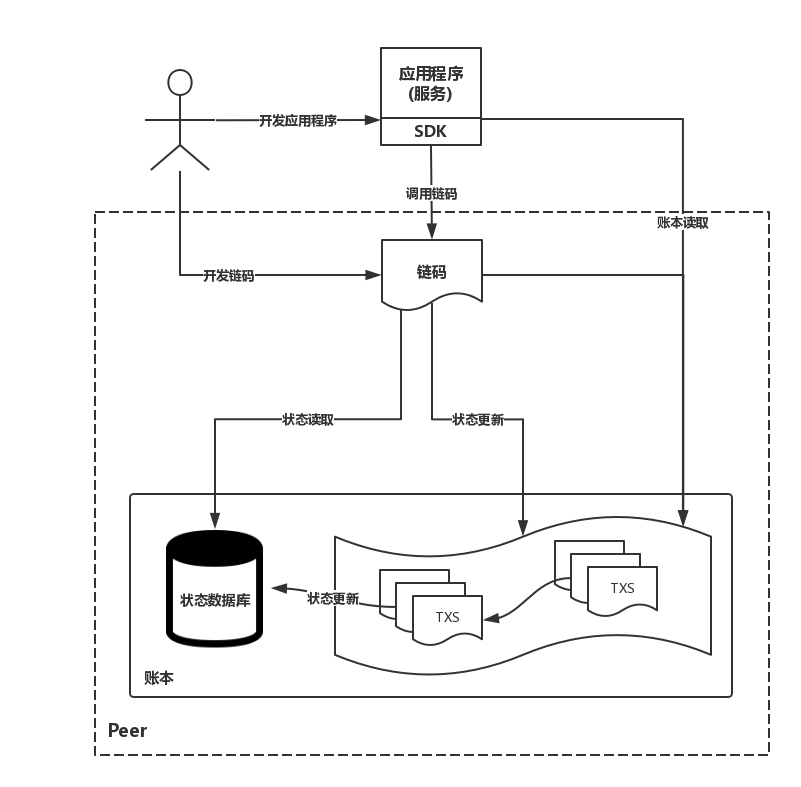

# 链码

### **生命周期**

- 打包：智能合约代码编码
- 安装：上传到背书节点
- 实例化：执行Init()
- 升级：对链码进行版本升级
- 交互：查询写入

### **5种系统链码**

- **LSCC（Lifecycle System Chaincode）生命周期管理链码**，安装、实例化、升级

- **CSCC（Configuration System Chaincode）配置管理链码**，如允许节点加入链

- **QSCC（Query System Chaincode）账本查询链码**，区块索引的外部服务

- **ESCC（Endorsement System Chaincode）交易背书链码**，对交易模拟结果进行封装、签名

- **VSCC（Validation System Chaincode）交易验证链码**

 

### **链码编程接口（shim.Chaincode）**

Init()               //用于链码初始化

Invoke()         //应用程序与链码交互的入口

接收的参数是链码SDK接口

 

### **链码SDK接口（shim.ChaincodeStubInterface）**

- 参数解析
- 交易信息
- 状态操作
- 链码互操作
- 事件发送
- 其他

 

### **链码编程禁忌**

1. 分布式系统、多节点隔离执行，必须保证执行结果一致
2. 随机函数
3. 系统时间
4. 不稳定的外部依赖

 

### **应用开发流程**

1. 需求整理（数据上链、交互方法）
2. 链码编写
3. 链码交互

