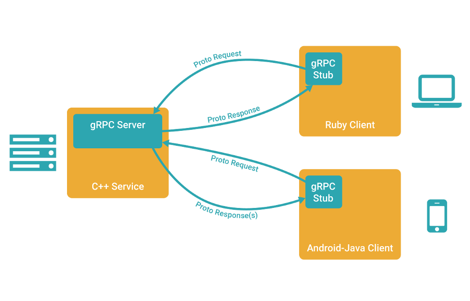
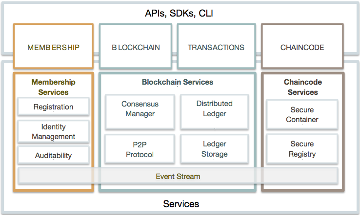
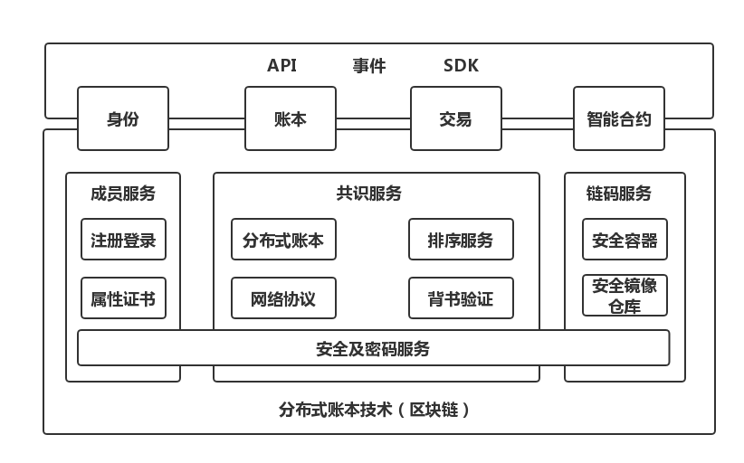
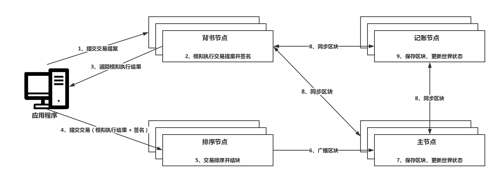

# 运行机制

**区块技术名词**

- 交易（Transaction），一次状态转移操作
- 区块（Block），交易的集合
- 链（Chain），区块的顺序排列

**区块链类型**

- 公有链
- 联盟链 *
- 私有链

**区块链特点**

- 去中心化
- 去信任化
- 数据共享
- 不可篡改

**区块链平台**

- 比特币，区块链1.0
- 以太坊，区块链2.0
- EOS（企业级区块链操作系统），区块链3.0
- 超级账本（Fabric）

**应用场景**

- 去信任（去中介）
- 价值转移
- 数据共享

**Hyperledger Fabric**

- 企业级联盟链基础设施
- 可插拔的共识机制（solo、kafka…）
- 多链多通道隔离

**智能合约**

- 合约协议的数字化代码表达
- 分布式有限状态机
- 执行环境安全隔离、不受第三方干扰（EVM、Docker）

**链码（Fabric智能合约）**

- Fabric应用层基石（中间件）

- 编程接口：Init()，Invoke()

### 系统架构

**gRPC**：基于HTTP/2、ProtoBuf，多语言支持的RPC框架，可以让客户端应用直接调用服务端应用的方法。

**智能合约**是业务逻辑的声明和定义，**交易**是业务逻辑的一次调用

**CAP原理**

- Consistency:一致性
- Availability:可用性
- Partition tolerance

### **网络拓扑**

##### 节点类型

- 客户端（应用程序/SDK/命令行工具）节点，连接orderer节点和peer节点

- Peer（Anchor/Endorser/Committer）节点
  - Anchor锚节点/主节点：一个组织只有一个，组织内部唯一与orderer节点通讯的节点，还负责与其他主节点交互账本数据
  - Endorser背书节点：模拟交易执行，为交易做担保
  - Commiter记账节点：所有Peer都是，用于验证区块的有效性和交易的有效性

- Orderer排序节点：从全网客户端接收交易，将交易进行排序，并将结果打包成区块供其他主节点同步区块；同是负责管理通道

  Solo排序、Kafka排序...

- CA节点（可选）：证书颁发机构，鉴明一个区块链的身份是否有效

### **交易流程**

- 交易模拟（背书@Endorser）
  1. 应用程序提交交易提案给背书节点
  2. 背书节点进行各种验证检查，然后模拟执行交易提案并签名
  3. 背书节点返回模拟执行结果给应用程序

- 交易排序（排序@Orderer）
  1. 应用程序提交带有结果和签名的交易给排序节点
  2. 排序节点将交易进行排序并打包成区块
  3. 排序节点广播打包好的区块

- 交易验证/交易存储（验证/存储@Committer）
  1. 主节点收到区块验证交易有效性，然后保存区块、更新世界状态
  2. 组织内部进行区块同步
  3. 记账节点保存区块、更新世界状态

### 优化&扩展

- 并不能完全满足企业需求
- 添加国密gm
- 区块链即服务（BaaS），k8s，docker
- 性能优化

