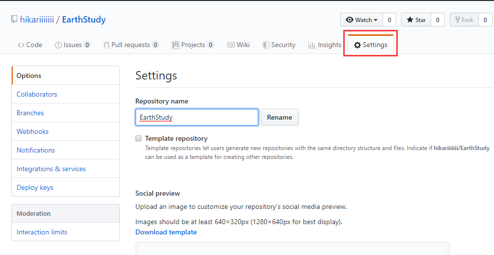
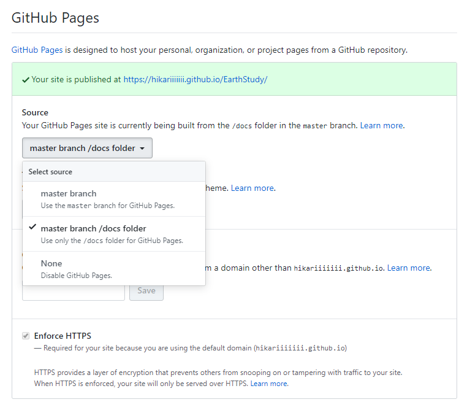

# GitBook

GitBook 是一个使用 Git 和 Markdown 来构建书籍的工具。它可以将你的书输出很多格式：PDF，ePub，mobi，或者输出为静态网页。

- **Git 方式**： 作为一枚程序员，Git 当然是日常生活中的必备工具。使用 Git 的方式去管理文档，除了其自身的优越性外，还大大降低了额外的学习成本，非常便捷。
- **Markdown**：Markdown 的优秀之处可以浓缩为一句：“简单通用，让你只需专注于内容创作”。
- **多种格式输出**：可以一键生成静态文件，非常便于静态站点的搭建。
- **其他**：有丰富的插件、支持多语言、组织结构极为清晰等等。


## 安装

环境：NodeJS(v4.0.0 及以上)

通过 npm 快速安装。gitbook-cli 一个用于在同一系统上安装和使用多个版本的 GitBook 的管理程序。它将自动安装所需版本的 GitBook 来构建一本书。

```
$ npm install gitbook-cli -g
```

安装指定版本：

```
$ gitbook fetch 3.2.3
```

查看当前安装版本：

```
$ gitbook -V
```

查看已安装版本：

```
$ gitbook -ls
```

## 管理

gitbook-cli 和 gitbook 是两个软件 , 通过 gitbook-cli 来管理 gitbook。

列出 gitbook 帮助信息：

```
$ gitbook help
```

列出 gitbook-cli 帮助信息：

```
$ gitbook --help
```

初始化文档结构 (根据 SUMMARY.md 文件生成目录结构)：

```
$ gitbook init
```

生成 HTML 文件：

```
$ gitbook build
```

本地预览 (会默认在本地运行 HTTP Server 监听 4000 端口，并生成 HTML 文件至 _book/ ）：

```
$ gitbook serve
```

## 使用

目录结构：

```
.
├── book.json   ##存放站点配置信息，例如:标题、作者、描述、插件、语言、版本、导航等├── README.md   ##书籍的简单介绍├── SUMMARY.md  ##定义目录结构的文件，文档左侧的目录就是根据这个文件来生成的，是用Markdown语法来定义目录树的父子关系的。├── Glossary.md ##词汇表文件，用于常用存储词汇信息。├── chapter-1/
|   └── something.md
└── chapter-2/    └── something.md
```

案例：Summary.md 文件

```
# Summary

## 介绍
* [Introduction](README.md)## 文档使用手册
* [简单使用三步走](simple_three_step.md)
* [Markdown常用语法](markdown_use.md)
* [Gitbook详解](gitbook.md)
    * [安装](gitbook/install.md)
    * [命令](gitbook/command.md)
    * [目录结构](gitbook/structure.md)
    * [常用插件](gitbook/plugin.md)
    * [book.json样例](gitbook/book_json.md)
* [文档设计](design.md)
    * [架构逻辑](design/framework.md)
    * [监控及维护](design/monitor_operation.md)
```

生成的文件目录结构：

```
├── book.json
├── design
│   ├── framework.md
│   └── monitor_operation.md
├── design.md
├── gitbook
│   ├── book_json.md
│   ├── command.md
│   ├── install.md
│   ├── plugin.md
│   └── structure.md
├── gitbook.md
├── GLOSSARY.md
├── markdown_use.md
├── README.md
├── simple_three_step.md
└── SUMMARY.md
```

book.json 样例简介：

```
{
"title": "Common",          ##标题
"description": "公共文档",   ##简述
"author": "Common",         ##作者
"language": "zh-hans",      ##语言
"gitbook": "3.2.3",         ##版本
"root": ".",
"structure": {
"readme": "README.md"
},
"links": {                 ##左侧导航栏信息"sidebar": {
"Home": "xxx"
}
},
"plugins": [               ##-：表示关闭此插件"-lunr",
"-search",
"highlight",               ##语法高亮"-livereload",
"-sharing",
"search-plus",             ##支持中文搜索
"simple-page-toc",         ##自动生成本页目录结构
"advanced-emoji",          ##支持emoji表情
"anchors",                 ##Github 风格的锚点样式
"include-codeblock",       ##插入代码块
"ace",                     ##支持ace
"emphasize",               ##文字加底色
"katex",                   ##数学公式插件
"splitter",                ##侧边栏宽度可自由调节
"tbfed-pagefooter",        ##添加脚页
"expandable-chapters-small",  ##目录可折叠
"sectionx",                   ##页面分块显示
"local-video",                ##视频插件(Video.js播放)
"anchor-navigation-ex",       ##悬浮导航
"todo",                       ##ToDo显示功能
"git-author",                 ##显示创建、修改记录
"alerts",                     ##不同alerts样式(info, warning, danger,success)
"include-csv"                 ##支持展示csv文件
],
"pluginsConfig": {
"theme-default": {
"showLevel": true},
"prism": {
"css": [
"prism-themes/themes/prism-base16-ateliersulphurpool.light.css"
]
},
"include-codeblock": {
"template": "ace",
"unindent": true,
"edit": true},
"tbfed-pagefooter": {
"copyright": "Copyright © xiaomi.com 2017",
"modify_label": "文档修订时间：",
"modify_format": "YYYY-MM-DD HH:mm:ss"
},
"simple-page-toc": {
"maxDepth": 3,
"skipFirstH1": true},
"anchor-navigation-ex": {
"showLevel": false,
"multipleH1":true,
"multipleH2":true,
"multipleH3":true,
    "mode": "float",
    "float": {
        "showLevelIcon": true,
        "level1Icon": "fa fa-hand-o-right",
        "level2Icon": "fa fa-hand-o-right",
        "level3Icon": "fa fa-hand-o-right"
    },
    "pageTop": {
       "showLevelIcon": true,
        "level1Icon": "fa fa-hand-o-right",
        "level2Icon": "fa fa-hand-o-right",
        "level3Icon": "fa fa-hand-o-right"
    }
},
"sectionx": {
"tag": "b"
},
"favicon": {
"shortcut": "favicon.ico",
"bookmark": "favicon.ico"
},
"git-author":{
    "position": "bottom",
    "createTpl": "Created by {user}：{timeStamp}",
    "modifyTpl": "Modified by {user}：{timeStamp}",
    "timeStampFormat": "YYYY-MM-DD"
},
"styles": {
    "website": "./styles/website.css"
},
"pluginsConfig": {
    "include-codeblock": {
        "template": "ace",
        "unindent": "true",
        "theme": "monokai"
    }
}
}
}
```

可以在本地运行如下命令来分别生成 pdf, epub, mobi 格式文件

```
gitbook pdf
```

```
gitbook epub
```
```
gitbook mobi
```
## GitHub Pages

GitHub Pages提供静态网站托管服务。

GitHub 上的每个仓库都可以拥有一个 GitHub Pages，对应的 URL 如下：

```
https://<username>.github.io/<repository>/
```

GitHub Pages 的静态资源支持下面 3 个来源：

-  `master` 分支
-  `master` 分支的 `/docs` 目录
-  `gh-pages` 分支

执行下面命令，将 `_book` 目录推送到 GitHub 仓库的 `gh-pages` 分支。

```
$ git subtree push --prefix=_book origin gh-pages
```

或者在生成静态网页时，将保存的目录指定为 `./docs`

```
$ gitbook build ./ ./docs
```

然后直接推送到 GitHub 仓库的。

```
$ git push origin master
```



