# TCP/IP、UDP、HTTP协议

## OSI（Open System Interconnect）七层参考模型

物理层 – 数据链路层 – 网络层 – 传输层 – 会话层 – 表示层 – 应用层

- 网中各节点都有相同的层次

- 不同节点的同等层具有相同的功能

- 同一节点内相邻层之间通过接口通信

- 每一层使用下层提供的服务，并向其上层提供服务

- 不同节点的同等层按照协议实现对等层之间的通信

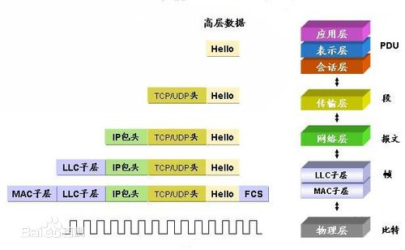

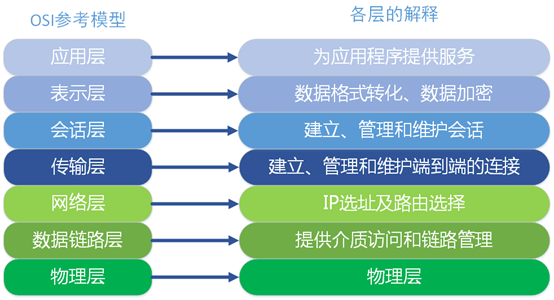

1. **物理层协议**：
   负责0、1 **比特流**（0/1序列）与电压的高低、逛的闪灭之间的转换。规定了激活、维持、关闭通信端点之间的机械特性、电气特性、功能特性以及过程特性；该层为上层协议提供了一个传输数据的物理媒体，只是说明标准。
   在这一层，数据的单位称为**比特（bit）**（注：bit和字节Byte，我们常说的1字节8位2进制即：1B=8bit）。属于物理层定义的典型规范代表包括：EIA/TIA RS-232、EIA/TIA RS-449、V.35、RJ-45、fddi令牌环网。

2. **数据链路层协议**：
   负责物理层面上的互联的、节点间的通信传输（例如一个以太网项链的2个节点之间的通信）；该层的作用包括：物理地址寻址、数据的成帧、流量控制、数据的检错、重发等。
   在这一层，数据的单位称为**帧（frame）**。数据链路层协议的代表包括：ARP、RARP、SDLC、HDLC、PPP、STP、帧中继等。

3. **网络层协议**：
   将数据**传输到目标地址**；目标地址可以使多个网络通过路由器连接而成的某一个地址，主要负责寻**找地址和路由选择**，网络层还可以实现拥塞控制、网际互连等功能。
   在这一层，数据的单位称为**数据包（packet）**。网络层协议的代表包括：IP、IPX、RIP、OSPF等。

4. **传输层协议**（核心层）：

   传输层是OSI中最重要、最关键的一层,是唯一负责总体的数据传输和数据控制的一层；
   传输层提供端到端的交换数据的机制，检查分组编号与次序，传输层对其上三层如会话层等，提供可靠的传输服务,对网络层提供可靠的目的地站点信息主要功能。在这一层，数据的单位称为数据段（segment）。主要功能：

   **①：**为端到端连接提供**传输服务**。

   **②：**这种传输服务分为可靠和不可靠的,其中Tcp是典型的可靠传输,而Udp则是不可靠传输。

   **③：**为端到端连接提供流量控制,差错控制,服务质量(Quality of Service,QoS)等**管理服务**。

   包括的协议如下：

   TCP：传输控制协议，传输效率低，可靠性强。

   UDP：用户数据报协议，适用于传输可靠性要求不高，数据量小的数据。

   DCCP、SCTP、RTP、RSVP、PPTP等协议。

5. **会话层协议：**
   负责建立和断开通信连接（数据流动的逻辑通路），记忆数据的分隔等数据传输相关的管理。

6. **表示层协议：**将数据格式转换为标准格式
   　　将应用处理的信息转换为适合网络传输的格式，或将来自下一层的数据转换为上层能够处理的格式；主要负责数据格式的转换，确保一个系统的应用层信息可被另一个系统应用层读取。具体来说，就是**将设备固有的数据格式转换为网络标准传输格式**，不同设备对同一比特流解释的结果可能会不同；因此，主要负责使它们保持一致。

7. **应用层协议：**

   **①：超文本传输协议HTTP：**这是一种最基本的**客户机/服务器的访问协议**；浏览器向服务器发送请求，而服务器回应相应的网页。

   **②：文件传送协议FTP**：提供交互式的访问，基于客户服务器模式，面向连接 使用TCP可靠的运输服务。主要功能:减少/消除不同操作系统下文件的不兼容性。 

   **③：**远程登录协议TELNET：客户服务器模式，能适应许多计算机和操作系统的差异，网络虚拟终端NVT的意义。

   **④：简单邮件传送协议SMTP**：Client/Server模式，面向连接。基本功能：写信、传送、报告传送情况、显示信件、接收方处理信件。 

   **⑤：DNS域名解析协议：**DNS是一种用以将域名转换为IP地址的Internet服务。

   **⑥：**简单文件传送协议TFTP：客户服务器模式，使用UDP数据报，只支持文件传输，不支持交互，TFTP代码占内存小。 

   **⑦：**简单网络管理协议（SNMP）: SNMP模型的4个组件：被管理结点、管理站、管理信息、管理协议。SNMP代理：运行SNMP管理进程的被管理结点。

   **⑧：**DHCP动态主机配置协议: 发现协议中的引导文件名、空终止符、属名或者空,DHCP供应协议中的受限目录路径名 Options –可选参数字段，参考定义选择列表中的选择文件。

## TCP/IP（Transmission Control Protocol/Internet Protocol）协议

传输控制协议/因特网互联协议，又名**网络通讯协议**，是Internet最基本的协议、Internet国际互联网络的基础。包括 ARP，ICMP，IGMP，UDP，以及让域名访问成为可能的DNS，以及电脑/手机可以自动获取IP地址的DHCP，还有形形色色的应用层的协议如 HTTP / SMTP / FTP 等。

通俗而言：TCP负责发现传输的问题，一有问题就发出信号，要求重新传输，直到所有数据安全正确地传输到目的地。而IP是给因特网的每一台电脑规定一个地址。

TCP/IP的四层模型：

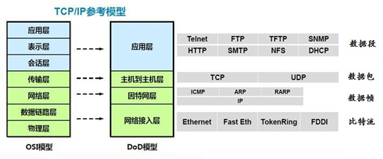

### IP（Internet Protocol）协议

IP协议是将多个包交换网络连接起来，它在源地址和目的地址之间传送一种称之为数据包的东西，它还提供对数据大小的重新组装功能，以适应不同网络对包大小的要求。IP协议在OSI参考模型中应用于网络层，以“数据包（Package）”为单位。

- 

#### IP协议特点

- IP协议是一种**无连接、不可靠**的分组传送服务的协议。
- IP协议是**点-点**线路的网络层通信协议。IP协议是针对原主机-路由器、路由器-路由器、路由器-目的主机之间的数据传输的点-点线路的网络层通信协议。
- IP协议屏蔽了网络在数据链路层、物理层协议与实现技术上的差异。：通过IP协议，**网络层向传输层提供的是统一的IP分组，传输层不需要考虑互联网在数据链路层、物理层协议与实现技术上的差异**，IP协议使得异构网络的互联变得容易了。

#### **IPV4**

地址32位，数据报首部的长度是以4个字节为单位，长度可以是20-60字节，这跟首部的HLEN字段有关，格式如下：

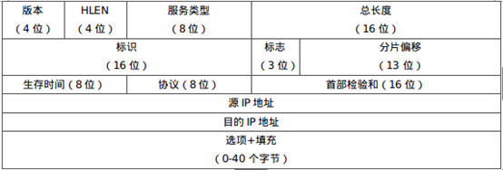

- **首部长度：**这个4位字段定义了数据报首部的长度，以**4字节**的字为**单位**。当首部**没有选项**时，首部长度位**20字节**；当这个字段值位最大值F时，首部长度**最大为60字节**。

- **服务类型：**在最初这个字段有一部分用于定义数据报的优先级，剩下的一部分定义了服务类型。IETF已经改变了这个8位字段的解释，现在定义了一组区分服务。在这种解释种，前6位构成了码点（codepoint），最后两位未使用。当码点字段最右边的3位不全为0时，这6位定义了54种服务，低延时，高吞吐量等等。

- **总长度：**这个16位字段定义了数据报总长度，其以字节为单位。故IPv4数据报总长度上限值位65536字节。注：为什么需要这个字段？在许多情况下，我们确实不需要这个字段值。但是有些情况下，封装在一个帧里的并不仅仅是数据报，还可能附加了一些**填充**。比如，以太网协议对帧的数据有最大值（1500字节）和最小值（46字节）的限制，当数据小于46字节时，数据将含有填充数据。

- **标识（identification）：**这个16位字段标志了从源主机发出的一个数据报，这样就确定了数据报的唯一性。这样使得数据报被分片后，在到达终点时终点能根据标识号将同一个数据报的分片重新组装成一个数据报。

- **标志（flag）：**第一位保留（未用），第二位为“不分片（do not fragment）”，第三位位“还有分片（more fragment）”。

- **分片偏移：**这个13位字段表示的是分片在整个数据报中的相对位置。这是数据在原始数据报中的偏移量，以8字节位单位。

- **生存时间：**这个8位字段用来控制数据报所经过的最大跳数（路由器），每经过一个路由器，这个字段数值都减1，减1后变位0时，路由器就丢弃这个数据报。

·       **协议：**这个8位字段定义了使用IPv4服务的高层协议，如TCP，UDP，ICMP，IGMP，OSPF等的数据都将被封装到IP数据报中。这个字段指明数据报必须交付给哪个最终目的协议。

- **检验和：**检验IP数据报首部。

- **源地址：**定义了源点的IP地址，这个字段始终保持不变。

- **目的地址：**定义了终点的IP地址，这个字段始终保持不变。

IP地址分为A、B、C、D 、E五类，把32位的地址分为两个部分：前面的部分代表网络地址，后面部分是主机地址（局域网地址）。网络掩码(Netmask) 限制了网络的范围，1代表网络部分，0代表设备地址部分。A类保留给政府机构，B类分配给中等规模的公司，C类分配给任何需要的人，D类用于组播，E类用于实验。

- A类地址：

  **1.0.0.1~126.155.255.254**，以“0”开始，1字节网络地址3字节主机地址

  10.X.X.X是私有地址（在互联网上不使用，而被用在局域网络中的地址）

  127.X.X.X是保留地址，用做循环测试用的

  默认子网掩码：255.0.0.0

- B类地址：

  **128.0.0.1~191.255.255.254**，以“10”开始，2字节网络地址2字节主机地址

  默认子网掩码：255.255.0.0

  172.16.0.0~172.31.255.255是私有地址

  169.254.X.X是保留地址。如果你的IP地址是自动获取IP地址，而你在网络上又没有找到可用的DHCP服务器，就会得到其中一个IP

- C类地址：

  **192.0.0.1~223.255.255.254**，网络地址的最高位必须是“110”，3字节网络地址1字节主机地址

  192.168.X.X是私有地址

  默认子网掩码：255.255.255.0

- D类地址：

  **224.0.0.1~239.255.255.254**，以“1110”开始，不分网络地址和主机地址，用于多点广播

- E类地址：

  **240.0.0.1~255.255.255.254**，以“11110”开始，不分网络地址和主机地址，将来使用

#### **IPV6**

地址128位，

- 冒分十六进制表示法：

  格式为X:X:X:X:X:X:X:X，其中每个X表示地址中的16b，以十六进制表示

- 0位压缩表示法：

  在某些情况下，一个IPv6地址中问可能包含很长的一段0，可以把连续的一段0压缩为“::”。但为保证地址解析的唯一性，地址中”::”只能出现一次。

- 内嵌IPv4地址表示法：

  为了实现IPv4-IPv6互通，IPv4地址会嵌入IPv6地址中，此时地址常表示为：X:X:X:X:X:X:d.d.d.d

报文格式如下：   

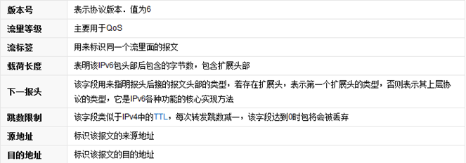

   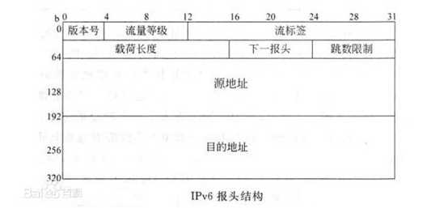

### **TCP**（Transmission Control Protocol）协议

TCP工作在网络OSI的七层模型中的第四层——Transport层（传输层），IP在第三层——Network层，ARP 在第二层——Data Link层。在第二层的数据，我们把它叫Frame（数据帧），在第三层的数据叫Packet（数据包），第四层的数据叫Segment（数据段）。 同时，我们需要简单的知道，数据从应用层发下来，会在每一层都会加上头部信息，进行封装，然后再发送到数据接收端。所以**数据的发送和接收其实就是数据的封装和解封装的过程**。

#### TCP报文格式：

   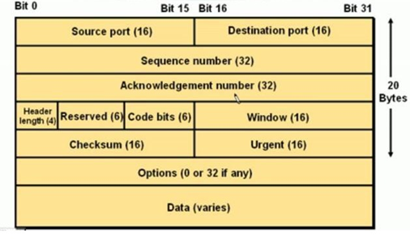

   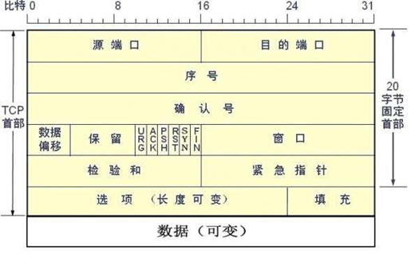

- **Source Port和Destination Port：**分别占用16位，表示源端口号和目的端口号；用于区别主机中的不同进程， 而IP地址是用来区分不同的主机的，源端口号和目的端口号配合上IP首部中的源IP地址和目的IP地址就能唯一的确定一个TCP连接；

- **Sequence Number：**用来标识从TCP发端向TCP收端发送的数据字节流，它表示在这个报文段中的第一个数据 字节在数据流中的序号；主要用来解决网络报乱序的问题；

- **Acknowledgment Number：**32位确认序列号包含发送确认的一端所期望收到的下一个序号，因此，确认序号应当是上次已成功收到数据字节序号加1。不过，只有当标志位中的ACK标志(下面介绍)为1时该确认序列号的字 段才有效。主要用来解决不丢包的问题；

- **Offset：**给出首部中32 bit字的数目，需要这个值是因为任选字段的长度是可变的。这个字段占4bit(最多能 表示15个32bit的字，即4*15=60个字节的首部长度)，因此TCP最多有60字节的首部。然而，没有任选字段， 正常的长度是20字节；

-  **TCP Flags:** TCP首部中有6个标志比特，它们中的多个可同时被设置为1，主要是用于操控TCP的状态机的，依次 为URG，ACK，PSH，RST，SYN，FIN。
  **URG：**此标志表示TCP包的紧急指针域(后面马上就要说到)有效，用来保证TCP连接不被中断，并且督促 中间层设备要尽快处理这些数据；
  **ACK：**此标志表示应答域有效，就是说前面所说的TCP应答号将会包含在TCP数据包中；有两个取值：0和1，为1的时候表示应答域有效，反之为0；
  **PSH：**这个标志位表示Push操作。所谓Push操作就是指在数据包到达接收端以后，立即传送给应用程序，而不是在缓冲区中排队；
  **RST：**这个标志表示连接复位请求。用来复位那些产生错误的连接，也被用来拒绝错误和非法的数据包；
  **SYN：**表示**同步序号**，用来建立连接。SYN标志位和ACK标志位搭配使用，当连接请求的时候，SYN=1， ACK=0；连接被响应的时候，SYN=1，ACK=1；这个标志的数据包经常被用来进行端口扫描。扫描者发送一个只有SYN的数据包，如果对方主机响应了一个数据包回来，就表明这台主机存在这个端口；但是由于这种扫描方式只是进行TCP三次握手的第一次握手，因此这种扫描的成功表示被扫描的机器不很安全，一台安全的主机将会强制要求一个连接严格的进行TCP的三次握手；

- **Window：**窗口大小，也就是有名的滑动窗口，用来进行流量控制。这是一个复杂的问题，本文不再论述。

#### TCP协议的三次握手：

　　TCP是**面向连接的，无论哪一方向另一方发送数据之前，都必须先在双方之间建立一条连接**。在TCP/IP协议中，TCP 协议提供可靠的连接服务，连接是通过三次握手进行初始化的。三次握手的目的是同步连接双方的序列号和确认号并交换 TCP窗口大小信息。如下图TCP的通信过程所示：

 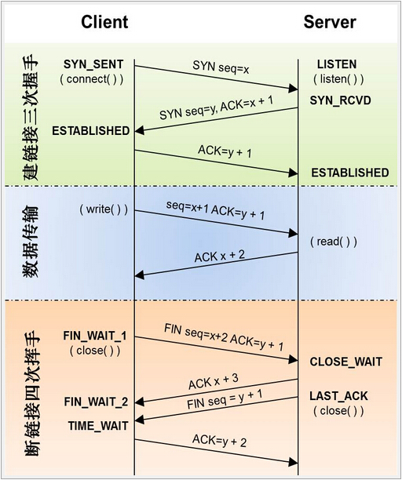

三次握手具体过程（状态）如下（其实可以类比**打电话**的过程：甲打电话，并等待接听→乙收到来电显示，“并表示可以接听”→“甲收到乙可以接听的信息”，甲接听电话。注：引号部分是打电话过程中没有的，但在TCP三次握手中存在）：

1. **第一次握手**：建立连接。客户端发送连接请求报文段，将SYN位置为1，Sequence Number为x；然后，客户端进入SYN_SEND状态，等待服务器的确认。（**客户的建立连接并等待确认**）
2. **第二次握手**：服务器收到SYN报文段。服务器收到客户端的SYN报文段，需要对这个SYN报文段进行确认，设置Acknowledgment Number为x+1(Sequence Number+1)；同时，自己还要发送SYN请求信息，将SYN位置为1，Sequence Number为y；服务器端将上述所有信息放到一个报文段(即SYN+ACK报文段)中，一并发送给客户端，此时服务器进入SYN_RECV状态。（**服务器端发送相关报文段信息并等待连接**）
3. **第三次握手**：客户端收到服务器的SYN+ACK报文段。然后将Acknowledgment Number设置为y+1，向服务器发送ACK报文段，这个报文段发送完毕以后，客户端和服务器端都进入ESTABLISHED状态，完成TCP三次握手。（**客户的接收到服务端信息并实现连接**）

　　然后，客户端和服务端就能实现正常的数据传输啦！

#### TCP协议的四次分手：

具体过程（状态）如下（同样也可以看做**挂电话**的过程：我说完了，挂？→我也说完了，挂吧？→好，拜拜→bye。简言之就是确认通信双方都交流完毕再确认断开连接）：

1. **第一次分手**：主机1(可以是客户端，也可以是服务器端)，设置Sequence Number和Acknowledgment Number，向主机2发送一个FIN报文段；此时，主机1进入FIN_WAIT_1状态；这表示主机1没有数据要发送给主机2了。（**一方数据发送完成**）
2. **第二次分手**：主机2收到了主机1发送的FIN报文段，向主机1回一个ACK报文段，Acknowledgment Number为Sequence Number加1；主机1进入FIN_WAIT_2状态；主机2告诉主机1，我也没有数据要发送了，可以进行关闭连接了。（**另一方数据发送完成**）
3. **第三次分手**：主机2向主机1发送FIN报文段，请求关闭连接，同时主机2进入CLOSE_WAIT状态。（**请求关闭连接并等待**）
4. **第四次分手**：主机1收到主机2发送的FIN报文段，向主机2发送ACK报文段，然后主机1进入TIME_WAIT状态；主机2收到主机1的ACK报文段以后，就关闭连接；此时，主机1等待2MSL（Maximum Segment Lifetime，“最长报文段寿命”）后依然没有收到回复，则证明Server端已正常关闭，那好，主机1也可以关闭连接了。（**关闭连接**）

现在，我们也应该理解为什么TCP协议是面向连接的、可靠的、基于IP协议的“通信控制协议”了。TCP的三次握手保证了数据的可靠性，保证资源不被浪费，而四次分手保证连接的可靠性而不至于随意断开连接，但TCP协议也由其可靠性，数据传输效率变得较低，而不像UDP那样进行实时快速传输。

### UDP（User Datagram Protocol）协议

UDP （User Datagram Protocol的简称），**用户数据报协议**，是OSI参考模型中一种无连接的传输层协议，提供面向事务的简单不可靠信息传送服务，IETF RFC 768是UDP的正式规范。UDP在IP报文的协议号是17。

与TCP协议一样，UDP协议直接位于IP协议的顶层。根据OSI参考模型，UDP和TCP都属于传输层协议。UDP协议的主要作用是将网络数据流量**压缩成数据包的形式**。一个典型的数据包就是一个二进制数据的传输单位。每一个数据包的前8个字节用来包含报头信息，剩余字节则用来包含具体的传输数据。

#### UDP报文格式

与TCP协议不同，UDP协议是非面向连接的不可靠协议，因此没有了SYN等处理两端等待或连接的报文段，相比之下，UDP的报文格式更为简单，主要由报文头（由均16位的源端口号、目的端口号、UDP长度和UDP校验和组成）和具体传输数据组成。如图所示：

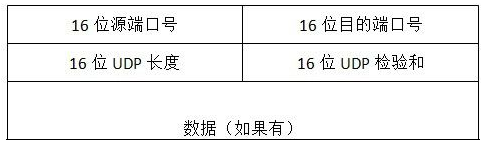

- **UDP长度：**UDP报文的整个大小，最小为8个字节（16*4位）（仅为首部）。
- **UDP检验和：**在进行检验和计算时，会添加一个**伪首部**一起进行运算。伪首部（占用12个字节）为：4个字节的源IP地址、4个字节的目的IP地址、1个字节的0、一个字节的数字17、以及占用2个字节UDP长度。这个伪首部不是报文的真正首部，只是引入为了计算校验和。相对于IP协议的只计算首部，UDP检验和会把首部和数据一起进行校验。接收端进行的校验和与UDP报文中的校验和相与，如果无差错应该全为1。如果有误，则将报文丢弃或者发给应用层、并附上差错警告。

#### UDP特性

- UDP是一个**无连接协议**，传输数据之前源端和终端不建立连接，当 UDP想传送时就简单地去抓取来自应用程序的数据，并尽可能快地把它**扔到网络上**。在发送端，UDP传送数据的速度仅仅是受应用程序生成数据的速度、计算机的能力和传输带宽的限制；在接收端，UDP把每个消息段放在队列中，应用程序每次从队列中读一个消息段。
- 由于传输数据不建立连接，因此也就**不需要维护连接状态，包括收发状态等**，因此一台服务机可同时向多个客户机传输相同的消息。
- UDP信息包的标题很短，只有8个字节，相对于TCP的20个字节信息包的额外开销很小。
- 吞吐量不受拥挤控制算法的调节，只受应用软件生成数据的速率、传输带宽、源端和终端主机性能的限制。
- UDP使用尽最大努力交付，即不保证可靠交付，因此主机不需要维持复杂的链接状态表（这里面有许多参数）。
- **UDP是面向报文的**。发送方的UDP对应用程序交下来的报文，在添加首部后就向下交付给IP层。既不拆分，也不合并，而是保留这些报文的边界，因此，应用程序需要选择合适的报文大小。 虽然UDP是一个不可靠的协议，但它是分发信息的一个理想协议。例如，在屏幕上报告股票市场、在屏幕上显示航空信息等等。UDP也用在路由信息协议RIP（Routing Information Protocol）中修改路由表。在这些应用场合下，如果有一个消息丢失，在几秒之后另一个新的消息就会替换它。UDP广泛用在多媒体应用中，例如，Progressive Networks公司开发的RealAudio软件，它是在因特网上把预先录制的或者现场音乐实时传送给客户机的一种软件，该软件使用的RealAudio audio-on-demand protocol协议就是运行在UDP之上的协议，大多数因特网电话软件产品、聊天用的ICQ和QQ也都运行在UDP之上。

### TCP协议和UDP协议的区别

#### 1. 一般区别

- TCP是面向连接的，传输数据保证可靠性和安全性；UDP协议是非面向连接的，是不可靠但高效率的协议。

- TCP占用资源多而UDP占用少。

- TCP是流模式而UDP是数据报模式。

  TCP是面向连接的，用打电话的过程来类比，就是通信双方是互相明确的，所以进行的是“你一句我一句”的交流，TCP整个通信过程间有一个缓存区，由于通信主体明确，因此可以断断续续地进行交流，数据好比水流，知道源头和目的地，因此称为**流模式**。反过来，UDP是非面向连接的，好比写信的过程，假设我们只要知道佩奇的地址，我们就能写信给佩奇，而佩奇却不认识我们。这样发起通信方的身份是不明确的，每个发送端的信息都不能和别的发送端混淆，不然会造成数据失效，所以UDP要对数据进行“打包”发送，是面向报文的，就像写信需要用信封套起来，不然只发送数据甚至数据混合会变得毫无意义。

- TCP和UDP的应用场景和编程方式也有很大差别。

#### 2. TCP的粘包和UDP的丢包

**TCP粘包现象：**TCP粘包是指发送方发送的若干包数据到接收方接收时粘成一包，从接收缓冲区看，后一包数据的头紧接着前一包数据的尾。

粘包原因：

- **发送端**：TCP默认会使用Nagle算法。而**Nagle算法**主要做两件事：1）只有上一个分组得到确认，才会发送下一个分组；2）收集多个小分组，在一个确认到来时一起发送。所以，正是Nagle算法造成了发送方有可能造成粘包现象。
- **接收端**：TCP接收到分组时，并不会立刻送至应用层处理，或者说，应用层并不一定会立即处理；实际上，TCP将收到的分组保存至接收缓存里，然后应用程序主动从缓存里读收到的分组。这样一来，如果TCP接收分组的速度大于应用程序读分组的速度，多个包就会被存至缓存，应用程序读时，就会读到多个首尾相接粘到一起的包。

粘包处理：如果黏在一起的包是同一个整体，即同意部分数据分割而来的，那么就不用进行处理。如果是不同部分的数据粘到一起，就需要进行粘包解决：

- **发送端导致**：使用TCP_NODELAY选项来关闭Nagle算法。
- **接收端导致**：暂无。
- **统一解决（应用层）**：可以解决接收方造成的粘包问题，还能解决发送方造成的粘包问题。
  解决方法就是**循环处理**：应用程序在处理从缓存读来的分组时，读完一条数据时，就应该循环读下一条数据，直到所有的数据都被处理；但是如何判断每条数据的长度呢？
  两种途径：
  　　1）**格式化数据**：每条数据有固定的格式（**开始符、结束符**），这种方法简单易行，但选择开始符和结束符的时候一定要注意每条数据的内部一定不能出现开始符或结束符；
         2）**发送长度（推荐）**：发送每条数据的时候，**将数据的长度一并发送**，比如可以选择每条数据的前4位是数据的长度，应用层处理时可以**根据长度来判断每条数据的开始和结束**。

**UDP丢包现象：**丢包现象即使用UDP发送时，由于不可靠连接方式，收到各种因素影响，数据包可能会在接受过程中丢失一部分，从而导致数据不完整。

UDP丢包原因：

- **发送端**：发送的包太大导致send方法**无法正常切割**为小包导致丢包、发送的包太大**超过缓存设置**也会出现对包、发送频率太快导致接收端未接受或溢出缓冲区而丢包。
- **接收端：**处理时间过长导致丢包。
- **其他**：网络等问题。

UDP丢包处理：

- UDP的缺陷在于丢包和乱序问题，一般视情况进行处理，而发送的时候也需要注意上述导致丢包的问题。

### HTTP（HyperText Transfer Protocol）协议

HTTP，超文本传输协议，是互联网上应用最为广泛的一种网络协议。所有的万维网WWW（World Wide Web）文件都必须遵守这个标准。

HTTP基于TCP/IP通信协议来传递数据（HTML 文件, 图片文件, 查询结果等）

HTTP是一个属于应用层的面向对象的协议

HTTP协议工作于客户端-服务端架构为上

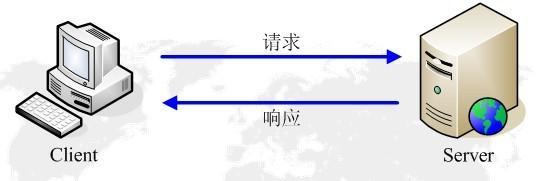

#### HTTP特点

**HTTP是一个客户端和服务器端请求和应答的标准**，通常，由HTTP客户端发起一个请求，建立一个到服务器指定端口（默认是80端口）的TCP连接。HTTP服务器则在那个端口监听客户端发送过来的请求。一旦收到请求，服务器（向客户端）发回一个状态行。 HTTP协议的网页 HTTP协议的网页 **HTTP使用TCP而不是UDP**的原因在于（打开）一个网页必须传送很多数据，而TCP协议提供传输控制，按顺序组织数据，和错误纠正。

通过HTTP或者HTTPS协议（HTTP协议+SSL协议）请求的资源由统一资源标示符（Uniform Resource Identifiers）（或者，更准确一些，URLs）来标识。HTTP有以下特点：

- **简单快速**：客户向服务器请求服务时，只需传送请求方法和路径。请求方法常用的有GET、HEAD、POST。每种方法规定了客户与服务器联系的类型不同。由于HTTP协议简单，使得HTTP服务器的程序规模小，因而通信速度很快。
- **灵活**：HTTP允许传输任意类型的数据对象。正在传输的类型由Content-Type加以标记。
- **无连接**：无连接的含义是限制**每次连接只处理一个请求**。**服务器处理完客户的请求，并收到客户的应答后，即断开连接。**采用这种方式可以节省传输时间。
- 无状态：HTTP协议是无状态协议。**无状态是指协议对于事务处理没有记忆能力**。缺少状态意味着如果后续处理需要前面的信息，则它必须重传，这样可能导致每次连接传送的数据量增大。另一方面，在服务器不需要先前信息时它的应答就较快。
- 支持B/S及C/S模式。

#### HTTP的URL地址

URL（UniformResourceLocator，统一资源定位符）是一种特殊类型的URI，包含了用于查找某个资源的足够的信息，是互联网上用来标识某一处资源的地址。

URL的各部分组成：

http://www.heyaguang.com:8080/EarthStudy/index.html?var1=1&var2=2#name

- **协议部分**：一般为HTTP或Https，后接//作为分隔符。
- **域名部分**：www.heyaguang.com为网站域名。
- **端口号部分**：此网址为8080。跟在域名后面的是端口号，域名和端口之间使用“:”作为分隔符。端口不是一个URL必须的部分，如果省略端口部分，将采用默认端口。
- **虚拟目录部分**：从域名后的第一个“/”开始到最后一个“/”为止，是虚拟目录部分。虚拟目录也**不是**一个URL必须的部分。
- **文件名部分**：从域名后的最后一个“/”开始到后面一个“？”为止，是文件名部分，如果没有“?”,则是从域名后的最后一个“/”开始到“#”为止，是文件部分，如果没有“？”和“#”，那么从域名后的最后一个“/”开始到结束，都是文件名部分。本例中的文件名是“index.html”。文件名部分也**不是**一个URL必须的部分，如果省略该部分，则使用默认的文件名。
- **参数部分**：从“？”开始到“#”为止之间的部分为参数部分。本例中的参数部分为“id=30303&page=2”。**不是**必要部分。
- **锚部分**：从“#”开始到最后，都是锚部分。本例中的锚部分是“name”。锚部分也**不是**一个URL必须的部分。

#### HTTP请求之request

客户端通过HTTP协议进行请求时遵循一定的格式，请看下面的请求报文格式（**由请求行、请求头、空行、请求体组成**）：

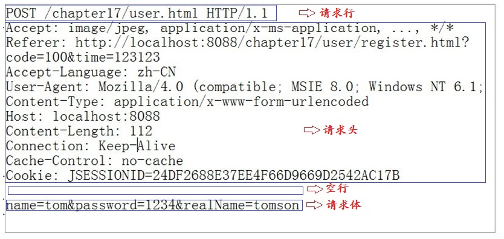

各部分组成如下所示：

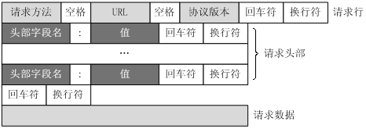

#### HTTP响应之response

在客户端发送请求后服务端进行响应，将信息发送给客户端，以实现功能服务，报文格式如下（**包含状态行、响应头、空行、消息体**）：

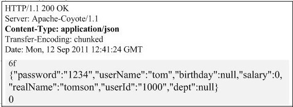

HTTP状态码分类：

| 分类 | 分类描述                                       |
| :--- | :--------------------------------------------- |
| 1**  | 信息，服务器收到请求，需要请求者继续执行操作   |
| 2**  | 成功，操作被成功接收并处理                     |
| 3**  | 重定向，需要进一步的操作以完成请求             |
| 4**  | 客户端错误，请求包含语法错误或无法完成请求     |
| 5**  | 服务器错误，服务器在处理请求的过程中发生了错误 |

HTTP状态码列表：

|      | 英文名称                        | 中文描述                                                     |
| :--- | :------------------------------ | :----------------------------------------------------------- |
| 100  | Continue                        | 继续。客户端应继续其请求                                     |
| 101  | Switching Protocols             | 切换协议。服务器根据客户端的请求切换协议。只能切换到更高级的协议，例如，切换到HTTP的新版本协议 |
|      |                                 |                                                              |
| 200  | OK                              | 请求成功。一般用于GET与POST请求                              |
| 201  | Created                         | 已创建。成功请求并创建了新的资源                             |
| 202  | Accepted                        | 已接受。已经接受请求，但未处理完成                           |
| 203  | Non-Authoritative Information   | 非授权信息。请求成功。但返回的meta信息不在原始的服务器，而是一个副本 |
| 204  | No Content                      | 无内容。服务器成功处理，但未返回内容。在未更新网页的情况下，可确保浏览器继续显示当前文档 |
| 205  | Reset Content                   | 重置内容。服务器处理成功，用户终端（例如：浏览器）应重置文档视图。可通过此返回码清除浏览器的表单域 |
| 206  | Partial Content                 | 部分内容。服务器成功处理了部分GET请求                        |
|      |                                 |                                                              |
| 300  | Multiple Choices                | 多种选择。请求的资源可包括多个位置，相应可返回一个资源特征与地址的列表用于用户终端（例如：浏览器）选择 |
| 301  | Moved Permanently               | 永久移动。请求的资源已被永久的移动到新URI，返回信息会包括新的URI，浏览器会自动定向到新URI。今后任何新的请求都应使用新的URI代替 |
| 302  | Found                           | 临时移动。与301类似。但资源只是临时被移动。客户端应继续使用原有URI |
| 303  | See Other                       | 查看其它地址。与301类似。使用GET和POST请求查看               |
| 304  | Not Modified                    | 未修改。所请求的资源未修改，服务器返回此状态码时，不会返回任何资源。客户端通常会缓存访问过的资源，通过提供一个头信息指出客户端希望只返回在指定日期之后修改的资源 |
| 305  | Use Proxy                       | 使用代理。所请求的资源必须通过代理访问                       |
| 306  | Unused                          | 已经被废弃的HTTP状态码                                       |
| 307  | Temporary Redirect              | 临时重定向。与302类似。使用GET请求重定向                     |
|      |                                 |                                                              |
| 400  | Bad Request                     | 客户端请求的语法错误，服务器无法理解                         |
| 401  | Unauthorized                    | 请求要求用户的身份认证                                       |
| 402  | Payment Required                | 保留，将来使用                                               |
| 403  | Forbidden                       | 服务器理解请求客户端的请求，但是拒绝执行此请求               |
| 404  | Not Found                       | 服务器无法根据客户端的请求找到资源（网页）。通过此代码，网站设计人员可设置"您所请求的资源无法找到"的个性页面 |
| 405  | Method Not Allowed              | 客户端请求中的方法被禁止                                     |
| 406  | Not Acceptable                  | 服务器无法根据客户端请求的内容特性完成请求                   |
| 407  | Proxy Authentication Required   | 请求要求代理的身份认证，与401类似，但请求者应当使用代理进行授权 |
| 408  | Request Time-out                | 服务器等待客户端发送的请求时间过长，超时                     |
| 409  | Conflict                        | 服务器完成客户端的 PUT 请求时可能返回此代码，服务器处理请求时发生了冲突 |
| 410  | Gone                            | 客户端请求的资源已经不存在。410不同于404，如果资源以前有现在被永久删除了可使用410代码，网站设计人员可通过301代码指定资源的新位置 |
| 411  | Length Required                 | 服务器无法处理客户端发送的不带Content-Length的请求信息       |
| 412  | Precondition Failed             | 客户端请求信息的先决条件错误                                 |
| 413  | Request Entity Too Large        | 由于请求的实体过大，服务器无法处理，因此拒绝请求。为防止客户端的连续请求，服务器可能会关闭连接。如果只是服务器暂时无法处理，则会包含一个Retry-After的响应信息 |
| 414  | Request-URI Too Large           | 请求的URI过长（URI通常为网址），服务器无法处理               |
| 415  | Unsupported Media Type          | 服务器无法处理请求附带的媒体格式                             |
| 416  | Requested range not satisfiable | 客户端请求的范围无效                                         |
| 417  | Expectation Failed              | 服务器无法满足Expect的请求头信息                             |
|      |                                 |                                                              |
| 500  | Internal Server Error           | 服务器内部错误，无法完成请求                                 |
| 501  | Not Implemented                 | 服务器不支持请求的功能，无法完成请求                         |
| 502  | Bad Gateway                     | 作为网关或者代理工作的服务器尝试执行请求时，从远程服务器接收到了一个无效的响应 |
| 503  | Service Unavailable             | 由于超载或系统维护，服务器暂时的无法处理客户端的请求。延时的长度可包含在服务器的Retry-After头信息中 |
| 504  | Gateway Time-out                | 充当网关或代理的服务器，未及时从远端服务器获取请求           |
| 505  | HTTP Version not supported      | 服务器不支持请求的HTTP协议的版本，无法完成处理               |