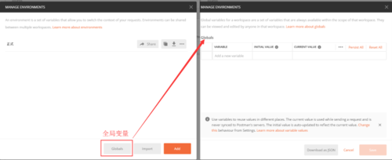
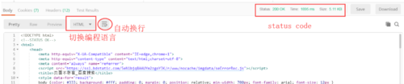
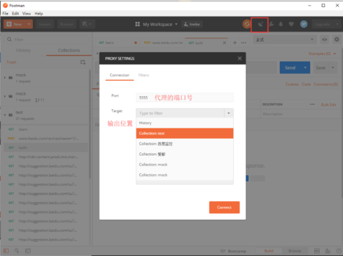
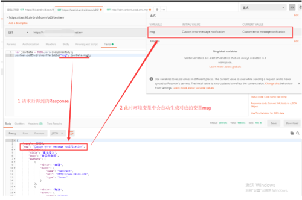

# **一、简介**

官方文档：https://learning.getpostman.com/docs/

本文基于Postman V7.0.7介绍

Postman是接口调试工具，是Chrome的插件之一。一个HTTP请求包括：URL、Method、Headers、Body，在Postman中均可设置。

有chrome插件版本和native版本，二者区别：

1、native版本可以直接操作cookies，而chrome版本需要安装扩展

2、有一些headers在chrome上时受限的，比如 origin and user-Agent；natice版本伪造身份比较容易

3、native版本自带proxy，可以用来抓包

4、native版本自带menu bar，用起来更顺畅

5、native版本才有don‘t follow redirect option（不跟随重定向）选项，可以测试接口类似于300、301的状态返回码

6、native版本自带postman console。在调试和打印的时候，可以用再写断言里面，把断言结果打印在console里面，方便测试。

接口请求流程：

# **二、基本功能**

### 1、工作区

默认为个人的“My Workspace”。ps：无法修改保存位置，只能修改工作区名称、备注和类型（个人、团队）。

### 2、新建测试集

### 3、环境配置

Postman变量有四种：Data（数据）、Local（局部）、Environment（环境）、Global（全局）。

优先级从高到低为：Data > Local > Environment > Global。

使用形式：{{变量名}}

1）环境变量

环境变量被设置为键值对，键为变量的名字。

优点：分离敏感数据，如keys、passwords。

INITIAL VALUE：初始值，默认和CURRENT VALUE保持一致。（可在设置中修改该配置）

CURRENT VALUE：当前值，在发送请求时使用，并且从不与Postman的服务器同步。

Persiet All：把两个值都改成 CURRENT VALUE

Reset All：把两个值都改成INITIAL VALUE

2）全局变量

全局变量提供了一组总是有效的变量。

和环境变量的联系与区别：

a、可以用很多环境变量，但同一时间只能有一组有效。但全局变量不受限，都有效。

b、若一个有效的环境变量和全局变量重名，那么全局变量将被环境变量覆盖。

c、若没有选择环境，Postman将会在全局变量中寻找对应的变量。

警告：环境变量和全局变量被存储为字符串。如果存储对象或数组，要确保在存储前使用JSON.stringify()格式化他们，在检索时使用JSON.parse()。

3）在请求构建器(Request)中的使用范围

URL

URL params

Header values

form-data/url-encoded values

Raw body cintent

Helper fileds

### 4、请求构建器（Request）

基本操作：选择请求方法（POST、GET等）- 输入URL（如www.baidu.com）- 点击send - 查看响应内容

ps：如果是get，请求参数直接写在url后，用？连接，如 http://suggestion.baidu.com/sd?wd=t&action=opensearch&ie=UTF-8&a=1

如果是post，则请求添加到body中

有15种请求方法，常用2种：POST、GET。可下拉选择、删除。

URL需要手动编码、解码。

#### 1）Parames

主要针对GET请求

可以单独的添加参数，Postman会自动的把他和URL整合到一起，如果你从其他的地方粘贴了URL过来，Postman也会自动的把 Params中的参数进行设置。

其中路径变量的样式为  /:变量名/，示例如下：

如果要设置他，单击Params按钮，key部分已被自动设置好了，根据需要填写value部分就行。

#### 2）Authorization

有10种授权方式，输入相关信息后，点击Preview Request/send，则在Headers中会自动生成一项Authorization的键值对。

a、Inherit auth from parent：从父级继承身份验证。默认选中。

b、Bearer Token：填写Token进行验证。

c、Basic Auth：基础身份认证。输入用户名和密码，直接明文发送数据

d、Digest Auth：摘要认证。消息摘要式身份认证是在基本身份认证上面扩展了安全性，服务器为每一个连接生成一个唯一的随机数，客户端用这个随机数对密码进行MD5加密，然后返回服务器，服务器也用这个随机数对密码进行加密，然后好客户端传送过来的加密数据进行比较，如果一致就返回结果。

客户端请求资源-> 服务器返回认证标示 -> 客户端发送认证信息 -> 服务器查验认证

e、OAuth 2.0：一个开放授权协议。支持获取OAuth 2.0 token并添加到requests中。

OAuth的作用：让"客户端"安全可控地获取"用户"的授权，与"服务商提供商"进行互动。具体实现：

OAuth在"客户端"与"服务提供商"之间，设置了一个授权层（authorization layer）。"客户端"不能直接登录"服务提供商"，只能登录授权层，以此将用户与客户端区分开来。"客户端"登录授权层所用的令牌（token），与用户的密码不同。用户可以在登录的时候，指定授权层令牌的权限范围和有效期。

"客户端"登录授权层以后，"服务提供商"根据令牌的权限范围和有效期，向"客户端"开放用户储存的资料。

#### 3）Headers

有多个变量，主要使用以下6个（KEY中输入关键词，会自动罗列相关变量）：

Accept-Charset：浏览器可接受的字符集。

Accept-Encoding：浏览器能够进行解码的数据编码方式，比如gzip。

Cookie：这是最重要的请求头信息之一

Host：初始URL中的主机和端口。

Referer：包含一个URL，用户从该URL代表的页面出发访问当前请求的页面。

User-Agent：浏览器类型，如果Servlet返回的内容与浏览器类型有关则该值非常有用。

可以添加一些常用的headers在Resets中。位置：Resets-Manage Resets。

****

#### 4）Body

主要针对POST请求。选择POST时，参数需要在这设置，不要写在URL后。

a、form-data:  表单数据。请求的时候会把表单以key-value的形式（key，value）上传到服务端，服务端在根据key获取相应的value。

form-data 也可以用于上传文件，但是在上传文件的时候，必须要选择file。

b、x-www-form-urlencoded：这个会把表单内的数据转换为键值对，比如name=123

ps：和form-data都是表单，区别是在请求上的显示不同。

c、raw：一个raw请求可以包含任意格式的内容、文件，可以上传text，json，xml，html (ps：这边需要根据服务端可以接收的类型来选择)

d、binary：用来上传二进制数据，通常用来上传文件。

#### 5）Pre-request Script

预置脚本，在请求之前执行。主要是对一些环境变量之类的进行设置（创建或销毁），相当于数据初始化。

ps：Tests也可以创建或销毁环境变量与全局变量，但是是在请求之后。

#### 6）Cookies

设置响应构建器中的cookies参数。

#### 7）Code

用来查看当前请求（请求头和请求体），可切换不同编程语言。

#### 8）Comments

评论当前请求。请求未保存时，该项置灰。

### 5、响应构建器（Response）

又称响应查看器，方便查看API的响应是否正确。

一个API响应器包括Boay、Headers、status code三部分。

#### 1）保存响应内容

点击save-自定义响应名称后点击 save Example-点击相应请求，右侧有Examples，点击可见之前的响应内容

#### 2）Body

查看响应的三种方式：

a、Pretty：显示格式化后的Json，可以让JSON和XML的响应内容显示得更美观规整。可切换编程语言和换行。

b、Raw：显示未处理的数据。

c、Preview：自动解析HTML页面，即以界面形式展示响应结果。

#### 3）Cookies

显示在请求构建器中设置的Cookies参数。

Postman v0.8.x及以上版本才有该功能。

4）Headers

显示一些键值对，表示了HTTP请求中header中的信息。

#### 5）status code

status code包括三项：Status（响应HTTP状态码）、Time（响应时长）、Size（响应大小）。

ps：当Body有statusCode时，二者联系：

只有HTTP状态码是200时，才代表这个接口请求是正确的。（HTTP协议定义的）

Body中的状态码，是程序员自己定义的，是为了让接口使用者去区分正常数据与异常数据。

### 6、History

所有发送过的请求都保存在左侧边栏的History中。若创建了Postman的账户，则这些历史数据将被同步到Postman的服务器，可以在不同平台上使用Postman的时候同步数据。

### 7、设置

1）General

1.Trim keys and values in request body

设为ON后，会修整所有使用表单数据或者URL编码模式来发送数据到服务器的参数。

2.Send no-cache header

设为ON后，会确保收到及时刷新的response。

3.Send postman-token header

这主要是用来绕过Chrome的一个bug：如果一个XMLHttpRequest处于等待状态，另一个request发送了同样的参数，Chrome将会为两个request返回同样的response。

发送一个随机的token将会避免这个问题。这同样也会帮助你区分服务端的request。

4.XHR Timeout（ms）

设置app等待响应的时间。

5.Automatically follow redirects

防止request返回一个300系列的response被自动重定向。

6.Open history/collection requests in a new tab

设为ON时，点击左侧边栏历史或者收藏里面的requests时，会在一个新的tab中打开。

设为OFF时，会在当前tab中打开。

7.Response Font Size

设置response视图中的字体大小。

8.UI Size

设置UI的大小。

9.Retain headers on clicking on links

在response中点击链接，Postman会为这个URL创建一个新的GET request。

设为ON，则可以保留当前的headers。

10.Language detection

可以强制指定显示body的编程语言。

11.Send anonymous usage data to Postman

设为ON，来禁止匿名用户使用数据。这使得Postman的保护性更好。

2）Theme

设置界面主题：白、黑

3）Shortcuts

快捷键设置

两个入口：顶部菜单-settings-Shortcuts ；底部菜单右侧-键盘图标（见下图）

4）Data

导入/导出collections

5）Add-ons

下载Newman入口，可配合Postman使用。

6）Certificates

7）Proxy

# **三、Runner（批量测试）**

1、两个入口

顶部菜单的Runner；Collections-具体项目-更多-Run。

2、基本设置

1）Iterations：迭代，可以设置执行次数。

2）Dealy：间隔时间，用例与用例间的间隔时间。

3）Data：外部数据加载，即用例的参数化，可以与Iterations结合使用，实现参数化，也就是数据驱动。

ps：执行方式是一个请求结束后执行下一个请求。不是并发执行。

# **四、断言（Tests&Test Results）**

一个完整的接口测试，包括：请求 -> 获取响应正文 -> 断言。

1、断言入口

请求响应器下的Tests。右侧SNIPPETS（片段）有基本语句，修改参数即可使用。

2、示例

断言场景如下：

1）判断HTTP返回状态码为200——对应SNIPPETS中的 Status code：Code is 200

2）判断响应正文中是否包含："statusCode":200——Response body：Contains string

3）解析响应正文，并判断statusCode的值是200，message的值是”Success”——“Response body：JSON value check

详解：

第一步，点击SNIPPETS中“Status code：Code is 200”，自动生成”判断HTTP返回状态码为200“的代码：

pm.test("Status code is 200", function () {

pm.response.to.have.status(200);

});

其中，pm.test 是一个内置对象，"Status code is 200"为函数名称，可自定义；function(){}为具体函数。

这句代码意思是：名称为"Status code is 200"的断言中，判断responseCode对象的HTTP状态码是否为200。

第二步，点击SNIPPETS中“Response body：Contains string”：

pm.test("Body matches string", function () {

pm.expect(pm.response.text()).to.include("string_you_want_to_search");

});

同上，”Body matches string“可自定义，string_you_want_to_search同字面意思，改成需要搜索的字段。

则 判断响应正文中是否包含："statusCode":200 的代码为：

pm.test("Body matches string", function () {

pm.expect(pm.response.text()).to.include('"statusCode":200');

});

注意：字符串中含双引号时需要用单引号包含，有单引号时要用双引导包含。

第三步，解析响应正文，就是要解析Json串。所以点击SNIPPETS中“Response body：JSON value check”：

pm.test("Your test name", function () {

var jsonData = pm.response.json();

pm.expect(jsonData.value).to.eql(100);

});

这是一个判断JSON语句，其中"Your test name"、jsonData.value、100 均为自定义。

则判断statusCode的值是200的代码为：

pm.test("code200", function () {

var jsonData = pm.response.json();

pm.expect(jsonData.statusCode).to.eql(200);

});

判断message的值是”Success”的代码为：

pm.test("messageok", function () {

var jsonData = pm.response.json();

pm.expect(jsonData.message).to.eql("Success");

});

综上，应有4个断言，则有对应的4个结果。

# **五、Poatman Console调试窗口**

该窗口可以看到请求的详细信息，并且在脚本中console打印的日志也会打印到这。

入口：快捷键Alt+Ctrl+C；顶部菜单-View-Show Postnam Console

# **六、脚本录制**

1、创建测试集

2、设置Postman代理

顶部菜单-Capture API requests with Postman，设置端口号（默认值为5555）、选择输出位置。

3、设置PC代理

可通过Chrome-设置-高级设置-打开代理设置-局域网（LAN）设置-代理服务器：

地址：localhost

host：5555（在Poatman中设置的端口号）

4、打开浏览器，访问接口，操作完成后在之前选择的保存位置有对应的request。

5、导出脚本

测试集-更多-导出-Collection v2.1（默认文件格式）-Export

ps：不创建测试集的话，抓到的请求就会在History中显示。

# **七、关联**

1、在配置的“正式”environment中，输入请求（ps：该请求返回的结果一定有JSON格式的）

2、在Tests输入：

var jsonData = JSON.parse(responseBody);

postman.setEnvironmentVariable("msg", jsonData.msg);

获取响应的数据中 msg 的值（jsonData.msg），然后赋值给字符“msg”  如: 响应数据是 "msg": "Custom error message notification"

在获取关联参数的时候可以设置一个environment，把获取的值放进去，给下个请求调用。

如果没有设置environment，则获取的参数不会被保存。

注意点：这里的脚本要看响应的返回形式来修改，如：

var jsonData = JSON.parse(responseBody);

postman.setEnvironmentVariable("uid", jsonData.result.uid);   

这里响应返回的格式里面是 result数组下的uid，所以获取uid脚本是 jsonData.result.uid

